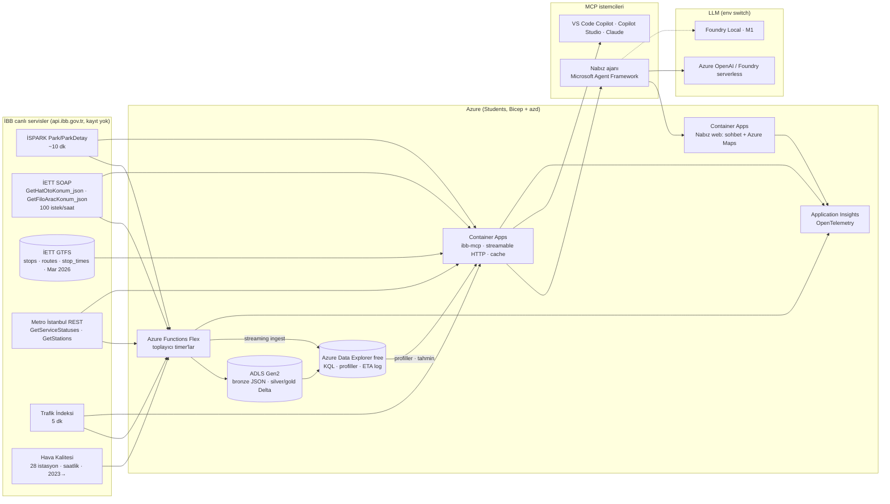

# İstanbul Nabız — Şehir Ajanı + İBB MCP Server

**Istanbul City Agent on Azure, powered by an open MCP server over İBB live data** · Microsoft AI Innovators · 7 günlük solo sprint · Plan v3, 8 Eylül 2026 (Nefes v2'den pivot; eski plan `docs/archive/PLAN-nefes-v2.md`)

> **Teslim tarihi / kanal:** `______` ← **Barbaros'un brifini bugün yazılı al** (video süresi, dil, repo public mı, yükleme adresi).

> **BLUF:** İBB'nin kayıt istemeyen canlı servislerini (İSPARK doluluk, İETT otobüs konumları, Metro arıza durumu, trafik indeksi, hava kalitesi) **tek bir MCP server** (`ibb-mcp`) hâline getiriyorsun; Azure Functions bu akışları saatlik/dakikalık Delta Lake + Azure Data Explorer'a biriktiriyor (İBB'nin kendisinin tutmadığı tarihçe); Microsoft Agent Framework ile yazılmış **"İstanbul Nabız" ajanı** bu MCP server'ın ilk müşterisi olarak vatandaşın gerçek sorularına canlı, kaynak atıflı, TR/EN cevap veriyor: *"Taksim'e 20 dakikaya varıyorum, hangi otoparkta yer var, ücreti ne?"*, *"500T 4. Levent'e ne zaman gelir?"*, *"M4'te arıza var mı, Kartal istasyonunda asansör var mı?"*, *"Beşiktaş'ta bugün koşu için hava ne zaman uygun?"*. Aynı MCP server VS Code Copilot, Copilot Studio ve Claude'dan da çalışıyor. Ölçülen şeyler: görev başarı oranı, otobüs ETA hatası (dakika), sayısal sadakat, veri tazeliği. Bicep + azd + GitHub Actions; haftalık maliyet ≈ 4–12 $; Fabric'e ve Azure OpenAI kotasına bağımlı değil.

---

## 1. Karar

### Neden pivot (Nefes → Nabız)
Nefes'in kullanıcısı hayali bir İBB operatörüydü; tahmin panosu bir ürün değil. Nabız'da kullanıcı gerçek: İstanbul'da araba süren, otobüse binen, metroya inen, dışarıda spor yapan herkes; ikinci kullanıcı da geliştirici (MCP'yi kendi ajanına takar). İBB'nin ayrı ayrı uygulamaları var (Mobiett, İSPARK, CepHava, Metro İstanbul) ama **tek konuşma arayüzü, açık MCP katmanı ve tarihçeye dayalı "genelde" cevabı** yok. Bu üçü Nabız'ın alanı.

### Dört kullanıcı yolculuğu (videonun omurgası; her biri bir eval senaryosu)

| # | Kullanıcı | Soru (TR) | Araç zinciri | Cevap ne içerir |
|---|---|---|---|---|
| J1 | Sürücü | "Taksim'e 20 dk sonra varıyorum, hangi otoparkta yer olur, ücreti ne?" | `places_resolve` → `ispark_find_parking` → `ispark_typical_occupancy` | 3 otopark, anlık boş yer, tarife, yürüme mesafesi, "bu saatte genelde %X dolu" (toplanan tarihçe), güncelleme damgası |
| J2 | Yolcu | "500T 4. Levent'e ne zaman gelir?" | `iett_stops_search` → `iett_next_arrivals` | En yakın 2 otobüs, kaç durak uzakta, tahmini dakika, son konum zamanı, planlanan sefer saati |
| J3 | Metro yolcusu / erişilebilirlik | "M4'te arıza var mı? Kartal'da asansör var mı?" | `metro_status` → `metro_station_info` | Canlı arıza bildirimi, asansör/yürüyen merdiven/bebek odası/WC bilgisi |
| J4 | Koşucu / ebeveyn | "Beşiktaş'ta bugün koşu için hava ne zaman uygun?" | `air_quality_now` → `air_quality_forecast` | Şu anki AQI + baskın kirletici, 6 saatlik tahmin, "en iyi pencere", sağlık metni |

Çapraz yolculuk (J5, stretch): "Şu an trafik nasıl, arabayla mı metroyla mı gideyim?" → `traffic_index` + `metro_status` + `ispark_find_parking`.

### Farklılaştırıcılar (README'de açıkça)
- **Açık MCP server**: `ibb-mcp` tek komutla (`uvx ibb-mcp`) VS Code Copilot / Copilot Studio / Claude'a takılır; İBB verisini tüketen ilk Microsoft-stack katman (GitHub'da yalnızca GeoJSON dönüştürücüler var).
- **Gateway'i koruyan tasarım**: İETT filo servisi 100 istek/saat, gateway ~15 hızlı çağrıda 503 → server tarafında paylaşımlı cache + tek toplayıcı; N kullanıcı = 1 çağrı.
- **Tarihçe İBB'de yok, sende var**: İSPARK doluluk ve otobüs konumu snapshot'ları Delta Lake'te birikiyor → "bu saatte genelde", "bu hatta ortalama hız", ETA doğruluğu ölçümü.
- **Ölçülen kullanılabilirlik**: 24 yolculuk senaryosunda görev başarı oranı; ETA MAE (gerçek varışlarla); sayısal sadakat; tazelik.
- **Aynı ajan** Foundry Local (M1) ve Azure'da; kamu verisi için edge/cloud kararı.
- **Şeffaf sınırlar**: İSBİKE servisi kapalı, hal fiyatları anahtar istiyor, PM2.5 API'de yok → README "Limitations".

### Önceki adaylar
EnerjiIQ ele (İBB yok, EPİAŞ kaydı, Azure OpenAI + AI Search bağımlılığı) · Fabric RTI stretch · Doc Intelligence ele · Fabric Data Agent ele · Azure SQL free = yedek servis katmanı · Nefes = J4 aracı olarak içeride.

---

## 2. Customer Business Outcome (videonun ilk 30 saniyesi)

- **Müşteri:** İBB Bilgi İşlem Dairesi Başkanlığı — Açık Veri Portalı ekibi. 556 veri seti, 41 API yayınlıyor ama tüketimi ölçülemeyen, ayrı ayrı SOAP/REST uçları; tek arayüz yok.
- **Persona:** Kartal'da oturan, işe bazen arabayla bazen 500T ile 4. Levent'e giden bir İstanbullu (500T gerçekten Şifa Sondurak–4. Levent Metro arasında, Kartal ve Maltepe köprülerinden geçiyor; 64 durak, GTFS'ten doğrulandı). **Karar:** evden çıkmadan önce 1 soru.
- **Bugün:** aynı cevap için 3 uygulama (İSPARK, Mobiett, CepHava) + tahmin yok + "genelde" yok.

**TR:** "İstanbul Nabız, İBB'nin canlı açık verisini tek bir MCP katmanına çevirip her Copilot'a takılabilir hâle getiriyor. Vatandaş tek soruyla otopark, otobüs, metro ve hava kalitesi cevabını **[T] saniyede** alıyor; 24 gerçek senaryoda görev başarısı **%[S]**, otobüs varış tahmini ortalama **[E] dakika** hata, her cevap kaynak ve zaman damgalı. İBB için sonuç: açık verinin tüketimi ölçülebilir, geliştirici bir komutla entegre oluyor."

**EN:** "Nabız exposes İBB live data as an open MCP server on Azure Container Apps, stores the history İBB doesn't keep in Delta Lake + Azure Data Explorer, and serves a Microsoft Agent Framework city agent with measured task success and ETA accuracy."

`[T] [S] [E]` Gün 5 eval'inden. **Uydurma sayı yok.**

---

## 3. Mimari



| Katman | Servis | Neden | Yedek |
|---|---|---|---|
| Toplayıcı | **Azure Functions Flex** (Python 3.12, 512 MB, UTC cron): İSPARK 10 dk, İETT filo 2 dk, Metro/trafik/AQ saatlik | Serverless, IaC; toplam ≈ 6k koşu/hafta ≈ sent | Linux Consumption Y1; Container Apps Job |
| Lake | **ADLS Gen2** bronze JSON.gz; silver/gold **Delta Lake** (`deltalake`) | "Lakehouse/Delta" anahtar kelimesi; Fabric OneLake shortcut Delta okur | Parquet |
| Analitik | **Azure Data Explorer free cluster** (KQL) | Aboneliksiz, ~100 GB, zaman serisi; Eventhouse ile aynı motor | Azure SQL free offer |
| MCP server | **Container Apps** (`minReplicas: 0`, streamable HTTP, Python `mcp` SDK), paylaşımlı cache (in-memory + ADX) | Free grant; azd remote build; Foundry Agent Service "MCP tool" olarak da takılır | Functions HTTP |
| Ajan | **Microsoft Agent Framework 1.x** (Python) — MCP client yerleşik | GA Nis 2026; OpenTelemetry | Düz OpenAI SDK + MCP client |
| LLM | §9 | | |
| UI | **Container Apps** FastAPI + tek sayfa (sohbet + **Azure Maps** G2: otoparklar, hat üstündeki otobüsler, istasyonlar) | Mobil görünüm videoda | Static Web Apps; MapLibre + OSM |
| Eval | **azure-ai-evaluation 1.18** + kendi görev-başarı ve ETA harness'ın | | |
| Gözlem | **Application Insights** | Trace ekranı = "ajan" kanıtı | |
| IaC/CI | **Bicep + azd** (başlangıç `Azure-Samples/functions-quickstart-python-http-azd`), **GitHub Actions** pytest + `az bicep build` | OIDC deploy stretch | Lokal `azd deploy` |

---

## 4. Veri

### 4.1 Doğrulanmış kaynaklar (7–8 Eyl 2026)

| Kaynak | Endpoint | Şema / boyut | Tazelik | Gotcha |
|---|---|---|---|---|
| İSPARK tüm otoparklar | `GET https://api.ibb.gov.tr/ispark/Park` | ~56 KB JSON: `parkID, parkName, lat, lng, capacity, emptyCapacity, workHours, parkType (AÇIK/KAPALI/YOL ÜSTÜ), freeTime, district, isOpen` | ~10 dk | Tek çağrıyla hepsi → toplayıcı için ideal |
| İSPARK detay | `GET .../ispark/ParkDetay?id=<parkID>` | + `updateDate ('07.09.2026 05:10:17'), monthlyFee, tariff (metin), address, areaPolygon (WKT)` | ~10 dk | Bilinmeyen id **dummy** döndürür (capacity 1) → id'yi Park listesine karşı doğrula; tarife metnini parse etme, olduğu gibi göster |
| İETT hat konumları | `POST https://api.ibb.gov.tr/iett/FiloDurum/SeferGerceklesme.asmx` SOAPAction `http://tempuri.org/GetHatOtoKonum_json`, body `<HatKodu>500T</HatKodu>` | **8 Eyl doğrulandı:** 500T → 32 araç `{kapino, boylam, enlem, hatkodu, guzergahkodu ('500T_G_D0'/'500T_D_D0'), hatad, yon, son_konum_zamani ('2026-09-08 08:58:49'), yakinDurakKodu}` | saniye | SOAP 1.1; JSON string XML içinde → `html.unescape` + `json.loads`; **100 istek/saat** (resmi PDF); 'ORA-' hataları sızabilir |
| İETT tüm filo | aynı servis, `GetFiloAracKonum_json` | 6.911 araç, 1,1 MB: `{Operator, Garaj, KapiNo, Saat, Boylam, Enlem, Hiz, Plaka}` | saniye | Toplayıcı 2 dk'da 1 çağrı (30/saat) → hız/hat profilleri; MCP hat sorgusu bu snapshot'tan filtreler |
| İETT GTFS | dataset `iett-gtfs-verisi` (Mar 2026) | `stops.csv 1,5 MB, routes.csv, trips.csv 5,8 MB, stop_times.csv 26 MB`; **shapes.txt yok** | 6 ay | ETA için durak sırası + kuş uçuşu mesafe; `yakinDurakKodu` ↔ `stop_id` eşleşmesini Gün 0'da doğrula |
| İETT planlanan sefer | `UlasimAnaVeri/PlanlananSeferSaati.asmx` `GetPlanlananSeferSaati_json(HatKodu)` | WSDL'den listelendi | — | Gün 0'da 1 çağrıyla şekli doğrula |
| Metro durum | `GET https://api.ibb.gov.tr/MetroIstanbul/api/MetroMobile/V2/GetServiceStatuses` | canlı arıza bildirimleri (hat, `UpdateDate`) | canlı | Help sayfası 503 ama endpoint çalışıyor |
| Metro istasyonlar | `.../GetStations` | 70 KB: `{Id, Name, LineId, LineName, Order, DetailInfo:{Escolator, Lift, BabyRoom, WC, Masjid, Latitude, Longitude}}` | statik | Erişilebilirlik cevabı buradan |
| Trafik indeksi | `GET https://api.ibb.gov.tr/tkmservices/api/TrafficData/v1/TrafficIndexHistory/{gün}/{5M|H|D}` | `{TrafficIndex 1–99, TrafficIndexDate}`; `/30/H` 30 gün | 5 dk | |
| Hava kalitesi | `GetAQIStations` (28) · `GetAQIByStationId?StationId&StartDate=dd.MM.yyyy%20HH:mm:ss&EndDate` | saatlik `Concentration{PM10,SO2,O3,NO2,CO}` + `AQI{…,AQIIndex,ContaminantParameter,State,Color}`; 30 günlük pencere tam döner | saatlik, 2023→ | AQI PM10 için 24 s ortalama; PM2.5 yok; NO2/CO sık null; `f=csv` kullanma |
| Yer adları | Azure Maps Search (5.000/ay ücretsiz) veya elle 100 satırlık `places.csv` (Taksim, Kadıköy…) | | | Demo için CSV yeter; Maps Search stretch |
| Kapalı / kullanma | İSBİKE (servis kapalı), hal fiyatları (anahtar ister), yol bakım (404), Belbim 68 GB set | | | README Limitations |

**Gateway kuralı:** tek toplayıcı, ≥ 6 sn aralık, exponential backoff, idempotent yazma; MCP server **asla** kullanıcı başına İBB'ye gitmez, cache'ten (TTL: İSPARK 5 dk, filo 60 sn, metro 5 dk, trafik 5 dk, AQ 30 dk) servis eder; cache boşsa tek uçuş (single-flight).

**Lisans:** İBB Açık Veri Lisansı (CC BY 4.0 tabanlı). README + UI + MCP server açıklaması: *"Kamu sektörü bilgilerini içerir — İBB Açık Veri Portalı, İBB Açık Veri Lisansı (CC BY 4.0)."*

### 4.2 Medallion
```
bronze/  ispark/ts=…json.gz · iett_fleet/… · metro_status/… · traffic_index/… · aq/station=…/…
silver/  ispark_snapshot (Delta): park_id, ts_utc, capacity, empty, occupancy_pct, is_open
         iett_fleet_snapshot (Delta): ts_utc, door_no, plate, lat, lon, speed, line_code?
         metro_status (Delta) · traffic_index_5m (Delta) · aq_hourly (Delta)
gold/    ispark_profile (park_id, weekday, hour → median occupancy, n) · iett_line_speed (line, hour → mean speed)
         eta_log (predicted_at, line, stop, predicted_min, actual_min) · aq_forecast · dq_daily
```
ADX tabloları aynı adlarla; materialized view'lar `arg_max` ile "son durum".

### 4.3 Veri kalitesi sözleşmesi (`DqDaily`)
Kaynak başına tazelik (son başarılı snapshot yaşı), boş/eksik oran, 503 sayısı, ETA log doluluğu. MCP aracı `city_freshness` bunu döndürür; ajan cevabın altına "veri yaşı" yazar.

---

## 5. `ibb-mcp` — MCP server

| Araç | Girdi | Çıktı | Kaynak · TTL |
|---|---|---|---|
| `places_resolve` | `query` ("Taksim") | lat, lon, ilçe | `places.csv` / Azure Maps Search |
| `ispark_find_parking` | lat, lon, `radius_km=1.5`, `min_free=1`, `open_now=true` | ≤ 5 otopark: ad, boş/kapasite, tür, tarife metni, mesafe, `updateDate` | Park + ParkDetay · 5 dk |
| `ispark_typical_occupancy` | park_id, weekday, hour | medyan doluluk %, örnek sayısı, "n günlük veri" notu | ADX `ispark_profile` |
| `iett_stops_search` | `query` ("Kadıköy"), `line?` | stop_id, ad, lat, lon, hatlar | GTFS |
| `iett_line_buses` | line_code | araçlar: yön, en yakın durak, son konum zamanı | GetHatOtoKonum · 60 sn |
| `iett_next_arrivals` | stop_id, line_code | en yakın 2 araç: kaç durak, tahmini dk, planlanan sefer | konum + GTFS sırası + `iett_line_speed` |
| `metro_status` | — | hat bazlı canlı bildirimler | GetServiceStatuses · 5 dk |
| `metro_station_info` | `name` | hat, sıra, asansör/yürüyen merdiven/WC/bebek odası | GetStations · 1 gün |
| `traffic_index` | `window=now|24h` | anlık 1–99 + dünkü aynı saat | 5 dk |
| `air_quality_now` | station | district | AQI, baskın kirletici, sağlık metni, saat | 30 dk |
| `air_quality_forecast` | station, horizon ≤ 6 | saatlik tahmin + "en iyi pencere" | ADX `aq_forecast` |
| `city_freshness` | — | kaynak başına veri yaşı | ADX `DqDaily` |

- Resources: `ibb://parks`, `ibb://lines`, `ibb://stations`, `ibb://aq-stations`. Prompt: `nabiz-system` (TR/EN kurallar).
- Her araç: Pydantic şema, deterministik, atıf alanı (`source_url`, `as_of`). Free-form sorgu yok.
- Hosting: Container Apps, streamable HTTP; okuma verisi kamuya açık ama `X-API-Key` opsiyonu + istek limiti (kendi gateway'ini korumak için).
- Kullanım: `uvx ibb-mcp` (stdio, lokal) veya URL (HTTP). Videoda **VS Code Copilot agent mode**'dan aynı server'a soru sor; Copilot Studio stretch (okul tenant'ı izin verirse).
- Testler: her araç için kayıtlı fixture ile kontrat testi + canlı smoke (CI'da atlanır).

---

## 6. Nabız ajanı (Microsoft Agent Framework)
- MCP client ile `ibb-mcp`'ye bağlanır; tek sistem promptu + dil kuralı; her sayıya kaynak + `as_of`; veri yoksa "veri yok / veri yaşı X dk".
- Sayısal sadakat kontrolü (`faithfulness.py`, TR `12,5` / `1.250` normalize): cevaptaki her sayı araç çıktısında var mı; yoksa yeniden üret.
- Client `LLM_BASE_URL`/`LLM_MODEL` ile Azure ↔ Foundry Local. Foundry Local'da tool-calling best-effort → yedek: JSON çıktı + dispatcher (MAF middleware).
- Tracing: OpenTelemetry → App Insights (agent → MCP tool → model span ekran görüntüsü README'ye).

---

## 7. Analitik ve ML (dürüst ölçek)
- **ETA motoru (asıl mühendislik):** hat için canlı araçlar + GTFS durak sırası → hedef durağa kalan durak sayısı × hat-saat ortalama durak-arası süre (`iett_line_speed`'den; ilk gün sabit 2 dk/durak). Her tahmin `eta_log`'a yazılır; toplayıcı, aracın hedef durağa gerçekten varışını (yakinDurakKodu eşleşmesi) işaretler → **ETA MAE** README'ye. Planlanan sefer saati ile çapraz kontrol.
- **Otopark profili:** toplanan snapshot'lardan `weekday × hour` medyan doluluk; n < 3 gün ise ajan "sınırlı veri" der. Stretch: 2+ hafta sonra LightGBM.
- **Hava kalitesi tahmini:** Nefes v2'nin çekirdeği, **3 saat timebox**: seasonal-naive + LightGBM saatlik PM10 (lag + takvim); geçemezse seasonal-naive ile devam. Olay eşiği ulusal 24 s > 50 µg/m³.
- **Hat hız profili:** filo snapshot'larından hat × saat ortalama hız = canlı trafik proxy'si (İBB trafik yoğunluğu setinin Ocak 2025'te durmasını telafi eder).

---

## 8. Üç katmanlı eval
1. **Araç kontratı:** 12 araç × fixture testleri; canlı smoke; tazelik.
2. **Görev başarısı:** `eval/journeys.jsonl` **24 senaryo** (J1–J4 × 6; 12 TR / 12 EN): beklenen araç zinciri, beklenen alanlar, yasak ifadeler ("kesin", "garanti"). Metrikler: **görev başarısı %S**, tool-call doğruluğu, **sayısal sadakat**, atıf oranı, p50/p95 gecikme, sorgu maliyeti; Groundedness/Relevance (`azure-ai-evaluation`; judge Azure OpenAI varsa, yoksa Foundry Local "küçük model judge").
3. **ETA doğruluğu:** `eta_log` → MAE/medyan hata, ≥ 200 gerçek varış (toplayıcı 4–5 günde toplar).
Videoda **başarısızlık + düzeltme anı**: ajan uydurulan boş yer sayısını söyler → sadakat kontrolü reddeder → cache'teki gerçek sayıyla, `updateDate` ile yeniden.

---

## 9. LLM karar ağacı (Gün 0)
```
1) ai.azure.com → Foundry projesi → gpt-4.1-mini Global Standard deploy dene
   ├─ TPM ≥ 10k → Azure OpenAI birincil (judge dahil); Foundry Local = "edge" demosu
   └─ kota 0 / bölge reddi → formu ANINDA doldur: https://aka.ms/oai/stuquotarequest
2) "sold by Azure" serverless model dene (Phi-4-mini / Mistral) — Eyl 2026 Q&A'da öğrenci başarılı bildirdi
3) Foundry Local birincil (phi-4-mini / qwen2.5-7b, `tools` etiketi); Azure gelirse env switch
4) Son çare: kişisel hesapta Azure free trial ($200, kart) yalnızca LLM için
```
GitHub Models 30 Tem 2026'da emekli → yedek değil. Risk: **Orta**.

---

## 10. Gün 0 — bugün (≈5 saat)
Makine: M1/16 GB, 31 GiB boş; Python 3.12.13 var (`/opt/homebrew/bin/python3.12`), sistem 3.14 kullanma; `az`, `azd`, `func`, `foundry` yok; Docker gerekmez.

```bash
# 0. Araçlar
brew install azure-cli azd uv
brew tap azure/functions && brew install azure-functions-core-tools@4
brew tap microsoft/foundrylocal && brew install foundrylocal     # docs'tan doğrula
uv venv -p 3.12 .venv && source .venv/bin/activate
foundry model list | grep -i tools && foundry model run phi-4-mini &

# 1. Abonelik / tenant / bölge
az login && az account show -o table
az policy assignment list -o table
az functionapp list-flexconsumption-locations -o table
for p in Microsoft.App Microsoft.Web Microsoft.Storage Microsoft.Maps Microsoft.CognitiveServices Microsoft.Insights; do az provider register -n $p; done

# 2. ADX free cluster KAPISI — aboneliğin sahibi AYNI kimlikle: https://dataexplorer.azure.com/freecluster → DB 'nabiz'
#    .create table T (ts:datetime, v:real) · .alter table T policy streamingingestion enable
#    Mac'ten azure-kusto-data with_az_cli_authentication → 1 sorgu + 1 ingest
#    Function MI: .add database nabiz ingestors ('aadapp=<clientId>;<tenantId>') → geçmezse app reg → o da yoksa Azure SQL free (DECISIONS #1)

# 3. LLM kapısı → §9; formu doldur

# 4. İBB probe (≥ 6 sn aralık) — ✔ = 8 Eyl'de doğrulandı
#    ✔ GetHatOtoKonum_json(500T) 32 araç · ✔ GetFiloAracKonum_json 6.911 · ✔ İSPARK Park/ParkDetay · ✔ Metro GetStations/GetServiceStatuses · ✔ trafik /30/H · ✔ AQ 30 gün
#    ☐ GetPlanlananSeferSaati_json(500T) şekli · ☐ GTFS indir, yakinDurakKodu ↔ stops.stop_id eşleşmesi · ☐ 20 çağrı @ 6 sn throttle · ☐ AQ 90/180 gün pencere

# 5. Azure Maps: az maps account create --sku G2 --kind Gen2 --location global → reddederse MapLibre + OSM
# 6. Budget $20 / $40; Sponsorships bakiyesi
# 7. gh repo create istanbul-nabiz --private; iskelet §12; DECISIONS.md ilk 5 karar
# 8. Toplayıcı v0'ı lokal çalıştır (İSPARK 10 dk, filo 2 dk) → BU GECE veri birikmeye başlasın; AQ backfill (2 yıl ≈ 1 saat) da
```
**Gün 0 "bitti":** lokal toplayıcı çalışıyor; headless ADX ingest geçti (veya SQL kararı); Flex bölgesi biliniyor; LLM yolu seçildi; GTFS eşleşmesi doğrulandı; teslim tarihi yazıldı.

---

## 11. Yedi günlük plan

| Gün | Odak | Bitti kriteri |
|---|---|---|
| **0** (Sal 8 Eyl) | §10 | yukarıda |
| **1** (Çar) | `ibb_client` (6 kaynak, cache, backoff, SOAP parse) + **10 test** (fixture) · azd iskeleti → `azd up` · toplayıcı Function (İSPARK 10 dk, filo 2 dk, metro/trafik/AQ saatlik) → bronze + silver Delta + ADX · CI (pytest + bicep build) · `DqDaily` | Function bulutta biriktiriyor; ADX'te 5 tablo; CI yeşil |
| **2** (Per) | **`ibb-mcp` v1**: 9 canlı araç (`places_resolve, ispark_find_parking, iett_stops_search, iett_line_buses, metro_status, metro_station_info, traffic_index, air_quality_now, city_freshness`) + kontrat testleri (**10 test**) · lokal stdio → **VS Code Copilot agent mode'da J1/J3 çalışıyor** | 9 araç; VS Code'dan canlı cevap (ekran görüntüsü) |
| **3** (Cum) | **ETA motoru** + `iett_next_arrivals` + `eta_log` yazımı + gerçek varış işaretleme · `ispark_typical_occupancy` (ADX profili) · AQ tahmini **3 saat timebox** + `air_quality_forecast` · MCP → Container Apps `azd deploy` (streamable HTTP, canlı URL) | 12 araç; MCP canlı URL; ETA log dolmaya başladı |
| **4** (Cmt) | Nabız web UI: sohbet + Azure Maps (otoparklar, hat araçları, istasyonlar, AQ renkleri), mobil görünüm · FastAPI · Container Apps deploy · ajan iskeleti (MAF + MCP client) | **Canlı URL**: J1–J4 arayüzden çalışıyor |
| **5** (Paz) | Ajan cilası (TR/EN, sadakat kontrolü + **8 test**) · 24 senaryoluk `journeys.jsonl` · eval koşusu (görev başarısı, sadakat, groundedness) · ETA MAE ilk rapor · tracing → App Insights · **Pazar akşamı freeze** | `eval/results/*.md`; trace ekranı; `[T] [S] [E]` dolduruldu |
| **6** (Pzt) | README (EN önce; rozetler; PNG mimari; **Sonuçlar > Kurulum**; MCP kurulum 1 komut; Limitations) · ARCHITECTURE · DECISIONS · NOTICE · ekran görüntüleri · video 2,5 dk · ücretli parçaları `azd down` (toplayıcı + MCP + ADX kalır) | Video yüklendi; README tam; bakiye kontrolü |
| **7** (Sal 15 Eyl) | **Önce teslim.** Stretch sırayla: `ibb-mcp` PyPI yayını · Copilot Studio bağlantısı · OIDC deploy · Azure Maps Search · Event Hubs → ADX · Fabric Eventhouse mirror · otopark LightGBM | Teslim, son tarihten önce |

**Kural:** Pazar akşamından sonra yeni özellik yok; kayma stretch'ten kesilir. Test hedefi ≥ 28 (10/10/8). Gün 3 ETA motoru kayarsa `iett_next_arrivals` "kaç durak uzakta + planlanan saat" ile teslim edilir, dakika tahmini stretch olur.

---

## 12. Repo yapısı
```
istanbul-nabiz/
├── README.md · PLAN.md · DECISIONS.md · ARCHITECTURE.md · LICENSE (MIT) · NOTICE (İBB atıf)
├── azure.yaml · infra/main.bicep · infra/modules/{storage,functions,containerapps,insights,maps}.bicep
├── packages/ibb_mcp/        server.py · tools/{ispark,iett,metro,traffic,aq,places,freshness}.py · cache.py · ibb_client.py · gtfs.py · eta.py · pyproject.toml (uvx ibb-mcp)
├── src/collector/           function_app.py (timers) · lake_writer.py · kusto_writer.py
├── src/analytics/           profiles.py (ispark, line_speed) · aq_forecast.py · eta_eval.py
├── src/agent/               agent.py (MAF + MCP client) · system_prompt.md · faithfulness.py
├── src/web/                 main.py (FastAPI) · static/index.html (sohbet + Azure Maps)
├── kql/                     schema.kql · profiles.kql · dq.kql
├── eval/                    journeys.jsonl · run_eval.py · results/
├── tests/                   test_ibb_client.py · test_mcp_tools.py · test_eta.py · test_faithfulness.py
├── data/reference/          places.csv · gtfs/ (indirilen) · aq_stations.json
├── docs/                    video_script.md · cost.md · mcp-usage.md (VS Code / Copilot Studio / Claude) · screenshots/ · archive/PLAN-nefes-v2.md
└── .github/workflows/       ci.yml · (stretch) deploy.yml · publish.yml
```
**DECISIONS.md tohumları:** #1 ADX free vs Eventhouse vs SQL · #2 MCP server = ürün, ajan = ilk müşteri · #3 tek toplayıcı + cache (100 istek/saat) · #4 ETA = durak sırası × hat-saat süresi, ML değil · #5 LLM yolu · #6 Delta > Parquet · #7 AQ tahmini timebox · #8 Nefes'ten pivot gerekçesi.

---

## 13. Maliyet (haftalık, USD)

| Kalem | Tahmin | Not |
|---|---|---|
| ADLS Gen2 + Functions host storage | < 0,30 | filo snapshot'ları ~1,1 MB × 720/gün ≈ 5,5 GB/hafta gz'siz → gzip + 2 dk (5 dk'ya düşürülebilir) |
| Azure Functions Flex 512 MB (~6k koşu/hafta) | ≈ 0,3 | grant öğrencide belirsiz |
| ADX free cluster | 0 | |
| Container Apps × 2 (MCP + web), `minReplicas: 0` | 0 | free grant içinde |
| ACR Basic | ≈ 1,2 | azd remote build |
| Azure Maps G2 | 0 | tile bol; Search stretch |
| App Insights | 0 | 5 GB/ay |
| Azure OpenAI / Foundry serverless (eval + demo) | 2–5 | varsa |
| **Toplam** | **≈ 4–8** | Budget $20/$40; AI Search Basic, Stream Analytics yok |

---

## 14. Video senaryosu (2:30; isimleri sesli söyle)

| Zaman | İçerik | Anahtar kelimeler |
|---|---|---|
| 0:00–0:30 | Başlık + canlı URL; persona; §2 cümlesi ile 3 sayı; mimari PNG; İBB atıfı | Customer Business Outcome, İBB Açık Veri, Microsoft Azure, MCP, Data + AI + Cloud |
| 0:30–1:20 | Telefon görünümünde J1 → J2 → J3 → J4 canlı; haritada otobüsler; **başarısızlık + düzeltme anı** | Azure Container Apps, Azure Data Explorer, KQL, Microsoft Agent Framework, Microsoft Foundry / Foundry Local, Azure Maps |
| 1:20–1:45 | **Aynı MCP server VS Code Copilot'ta**: "500T ne zaman gelir?" → Copilot İBB verisiyle cevaplıyor | Model Context Protocol, GitHub Copilot, Copilot Studio (stretch) |
| 1:45–2:15 | Mimari: Functions → Delta Lake → ADX → MCP → ajan; Bicep + azd; App Insights trace; kanıt tablosu (görev başarısı, ETA MAE, sadakat, tazelik), CI, maliyet | Bicep, azd, Delta Lake, OpenTelemetry, Azure AI Evaluation, GitHub Actions |
| 2:15–2:30 | Sonraki adımlar: PyPI, Copilot Studio connector, Fabric Eventhouse, Event Hubs | Microsoft Fabric, Real-Time Intelligence |

---

## 15. Riskler ve Plan B

| Risk | Olasılık | Etki | Plan B |
|---|---|---|---|
| Function → ADX free headless auth geçmez | Orta (Gün 0'a kadar bilinmiyor) | Yüksek | App reg + secret → Azure SQL free (MI) |
| İETT SOAP 100 istek/saat aşılır / ORA hatası | Orta | Orta | Tek toplayıcı + cache; hat sorgusu filo snapshot'ından; hata → "veri yaşı X dk" |
| `yakinDurakKodu` GTFS `stop_id` ile eşleşmez | Orta | Orta (ETA) | Koordinat ile en yakın durak; ETA "kaç durak" yerine "km + dk" |
| Gateway 503 dalgası | Orta | Orta | Backoff; cache'ten servis; "İBB servisi yanıt vermiyor, son bilinen değer" |
| Azure OpenAI kotası yok | Orta | Orta | Foundry serverless → Foundry Local |
| Foundry Local tool-calling güvenilmez | Orta | Orta | JSON + dispatcher; qwen2.5-7b |
| Bölge politikası Container Apps/Maps engeller | Orta | Orta | İzinli bölge; MapLibre + OSM |
| Gün 3 ETA motoru sarkar | Orta | Düşük | "kaç durak + planlanan saat" ile teslim; dakika stretch |
| Otopark profili için az veri | Yüksek (ilk hafta) | Düşük | Ajan "n günlük veri" der; README'de büyüyen veri seti |
| App registration / OIDC kapalı | Orta | Düşük | CI sadece test; lokal deploy |
| Spending limit | Düşük | Yüksek | Pahalı servis yok; budget; ADX + Foundry Local abonelikten bağımsız |

---

## 16. README kanıt listesi
- [ ] EN önce; rozetler (CI, test sayısı, lisans, PyPI stretch); **PNG** mimari ilk ekranda
- [ ] **Sonuçlar** Kurulum'dan önce: görev başarısı, ETA MAE (n varış), sadakat, tool-call doğruluğu, tazelik, p95
- [ ] `docs/mcp-usage.md`: VS Code / Copilot Studio / Claude için 1 komutluk kurulum + ekran görüntüleri
- [ ] App Insights trace (agent → MCP tool → model)
- [ ] `azd up` tek komut; `tests/` ≥ 28
- [ ] Limitations: İSBİKE kapalı, hal fiyatı anahtar, PM2.5 yok, 100 istek/saat, ETA "tahmini"
- [ ] Maliyet + "çalışır tutmanın aylık maliyeti"; DECISIONS.md; İBB atıfı; video linki

## 17. Yapılmayacaklar
Fabric'e bağlı kritik yol · rota planlama / çok modlu yolculuk optimizasyonu · kullanıcı hesabı/bildirim altyapısı · free-form NL2SQL · derin öğrenme · Copilot Studio kritik yolda · Power BI Desktop · Assistants API / prompt flow / Synapse / `azure-ai-inference` (emekli) · AI Search Basic · Stream Analytics · Belbim 68 GB · İSBİKE · hal fiyatları.

## 18. Doğrulanmış kaynaklar
- İBB CKAN: https://data.ibb.gov.tr/api/3/action/status_show · Lisans: https://data.ibb.gov.tr/license
- İETT web servis dokümanı (100 istek/saat): https://data.ibb.gov.tr/en/dataset/53b985b6-24af-4fda-aa59-1b45dde2e665/resource/6efd7520-0fbf-421b-975a-a73cb9137ef2/download/iett-web-servis-kullanm-dokuman.pdf · GTFS: https://data.ibb.gov.tr/api/3/action/package_show?id=iett-gtfs-verisi · Sefer gerçekleşme: https://data.ibb.gov.tr/dataset/sefer-gerceklesme-web-servisi
- İSPARK: https://data.ibb.gov.tr/api/3/action/package_show?id=ispark-otopark-detay-bilgileri-web-servisi
- Metro İstanbul API kataloğu: https://data.ibb.gov.tr/api/3/action/package_search?fq=res_format:API
- Trafik indeksi: https://data.ibb.gov.tr/dataset/trafik-indeks-degeri-web-servisi · Hava kalitesi: https://data.ibb.gov.tr/api/3/action/package_show?id=hava-kalitesi-istasyon-olcum-sonuclari-web-servisi · AQI mevzuatı: https://havakalitesi.ibb.gov.tr/Icerik/mevzuat/hava-kalitesi-indeksi
- Azure for Students: https://azure.microsoft.com/en-us/free/students/ · Spending limit: https://learn.microsoft.com/en-us/azure/cost-management-billing/manage/spending-limit
- Azure OpenAI öğrenci (Tem 2026): https://learn.microsoft.com/en-us/answers/questions/5949792/azure-for-students-unable-to-deploy-any-azure-open · Foundry serverless öğrenci (Eyl 2026): https://learn.microsoft.com/en-us/answers/questions/5994365/foundry-serverless-deployment-using-azure-students
- ADX free: https://learn.microsoft.com/en-us/azure/data-explorer/start-for-free · Kusto principals: https://learn.microsoft.com/en-us/kusto/management/reference-security-principals
- Functions Flex: https://learn.microsoft.com/en-us/azure/azure-functions/flex-consumption-plan · Container Apps billing: https://learn.microsoft.com/en-us/azure/container-apps/billing · Azure Maps Gen2: https://learn.microsoft.com/en-us/azure/azure-maps/how-to-manage-pricing-tier
- Microsoft Agent Framework 1.0 (MCP native): https://devblogs.microsoft.com/agent-framework/microsoft-agent-framework-version-1-0/ · Foundry Agent Service MCP tool: https://learn.microsoft.com/en-us/azure/foundry/agents/concepts/limits-quotas-regions · Foundry Local tool calling: https://learn.microsoft.com/en-us/azure/foundry-local/how-to/how-to-use-tool-calling-with-foundry-local
- azure-ai-evaluation: https://pypi.org/project/azure-ai-evaluation/ · OpenAIModelConfiguration: https://learn.microsoft.com/en-us/python/api/azure-ai-evaluation/azure.ai.evaluation.openaimodelconfiguration?view=azure-python
- GitHub Models emekliliği: https://docs.github.com/en/github-models/use-github-models/prototyping-with-ai-models
- Prior art (yalnızca dönüştürücüler): https://github.com/hakanatak/dataibbgovtr_python · https://github.com/lutfuahmet/ibbdata
- Bicep başlangıcı: https://github.com/Azure-Samples/functions-quickstart-python-http-azd
