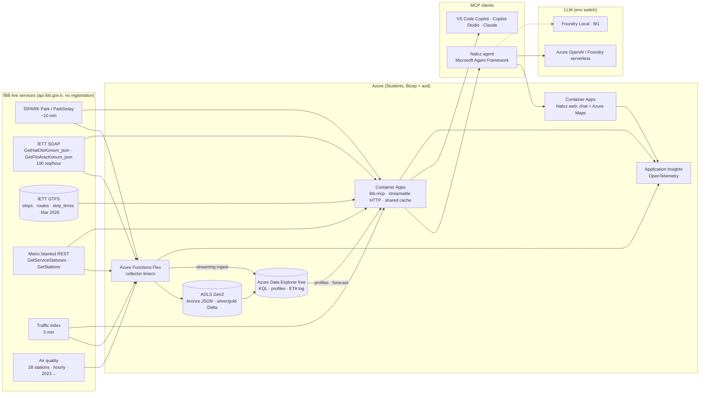

# İstanbul Nabız

**An unofficial MCP server and city agent over İstanbul's live open data** — parking, buses, metro, traffic and air quality, with a source URL and a timestamp attached to every number.

<!-- Badges. The CI badge goes live with .github/workflows/ci.yml (PLAN.md §11, Day 1). -->
[](https://github.com/muratcan-ates/istanbul-nabiz/actions)
[](https://github.com/muratcan-ates/istanbul-nabiz/actions)
[](LICENSE)
[](https://data.ibb.gov.tr/license)
[](pyproject.toml)

> **This is not an official İBB service.** İstanbul Nabız is an independent student project. It is not
> affiliated with, endorsed by or operated by the İstanbul Metropolitan Municipality (İBB), İETT, İSPARK
> or Metro İstanbul. Organisation names appear only to attribute the source of the data.
>
> Contains public sector information from the İstanbul Metropolitan Municipality Open Data Portal,
> licensed under the İBB Open Data Licence (CC BY 4.0) — <https://data.ibb.gov.tr/license>.
> Full attribution, personal-data handling and rate-limit policy: **[NOTICE.md](NOTICE.md)**.

---

## What it does

İBB publishes 556 datasets and 41 APIs behind separate SOAP and REST endpoints. There is a Mobiett app, an
İSPARK app, a CepHava app and a Metro İstanbul app — but no single conversational surface, no open
integration layer, and no history to answer *"how full is it **usually** at this hour?"*.

Nabız turns those live endpoints into **one MCP server** (`ibb-mcp`) that any agent can call, and ships a
city agent as its first client. Four journeys drive the design; each one is also an eval scenario
(PLAN.md §1):

| # | Who | The question | Tool chain | What the answer contains |
|---|---|---|---|---|
| **J1** | Driver | *"I'm reaching Taksim in 20 minutes — which car park will have space, and what does it cost?"* | `places_resolve` → `ispark_find_parking` → `ispark_typical_occupancy` | up to 5 car parks, live free spaces, tariff text as published, straight-line distance, "usually X% full at this hour", update stamp |
| **J2** | Bus passenger | *"When does the 500T get to Kadıköy?"* | `iett_stops_search` → `iett_next_arrivals` | nearest vehicles, how many stops away, estimated minutes, how the estimate was derived, last position time, planned departure |
| **J3** | Metro passenger / accessibility | *"Any disruption on M4? Is there a lift at Kartal?"* | `metro_status` → `metro_station_info` | live disruption notices, lift / escalator / baby room / WC / prayer room per station |
| **J4** | Runner, parent | *"When is the air good enough for a run in Beşiktaş today?"* | `air_quality_now` → `air_quality_forecast` | current AQI and dominant pollutant, hourly PM10 outlook, best window, health note |

Cross-journey (stretch): *"Is it faster to drive or take the metro right now?"* → `traffic_index` +
`metro_status` + `ispark_find_parking`.

**Three things make this more than an API wrapper:**

1. **It protects the upstream.** The İETT service documents a hard limit of 100 requests/hour and the İBB
   gateway starts 503-ing *every* service after roughly fifteen rapid calls. One shared collector plus a
   TTL cache with single-flight means N concurrent users produce at most one upstream request
   (`src/ibb_mcp/http.py`, `src/ibb_mcp/cache.py`).
2. **It keeps the history İBB does not.** İBB publishes current state only. Parking occupancy and fleet
   snapshots are accumulated into Delta Lake + Azure Data Explorer, which is what makes "usually at this
   hour" and a *measured* ETA error possible at all.
3. **It never invents a number.** Every tool returns a `ToolResult` carrying provenance (source URL,
   observation time, whether the read was stale). When upstream fails the answer says how old the data is
   instead of guessing, and the eval harness rejects any number in an answer that is not in a tool result.

## Project status

Day 0 of a seven-day solo sprint (PLAN.md §11). This README documents the target system and marks
honestly what runs today.

| Layer | State | Where |
|---|---|---|
| İBB client, cache, models, GTFS repair, ETA engine | **working** | `src/ibb_mcp/{http,cache,models,gtfs,eta}.py` |
| 12 tool implementations behind one façade | **working** | `src/ibb_mcp/tools.py`, `src/ibb_mcp/sources/` |
| Recorded fixtures for all 6 upstreams + fixture-backed test suite (188 passed, 6 xfailed, no network — Day 0) | **working** | `tests/fixtures/`, `tests/` |
| MCP server entry point (`ibb-mcp`, stdio + streamable HTTP), 12 tools + `ibb://attribution` | **working** — stdio verified against a real MCP client | `src/ibb_mcp/server.py` |
| Collector Functions, Delta Lake, ADX tables | **planned** — Day 1 | `src/nabiz/collector/`, `kql/` |
| Agent (Microsoft Agent Framework) and web UI | **planned** — Days 4–5 | `src/nabiz/{agent,web}/` |
| Bicep + `azd` infrastructure, GitHub Actions CI | **planned** — Day 1 | `infra/`, `.github/workflows/` |
| Eval harness and results | **planned** — Day 5 | `eval/` |

## Architecture

<!-- PLACEHOLDER: replace with the rendered diagram once it exists.
     
     TODO(Day 6): export docs/screenshots/architecture.png from the mermaid source below. -->

> **`docs/screenshots/architecture.png` — placeholder.** The PNG export of the diagram below is added on
> Day 6 and will appear here, above the fold, for readers whose viewer does not render mermaid.



The MCP server is the product; the agent is its first customer. Both read the same cached, provenance-
stamped tool layer, so a question asked in VS Code Copilot and the same question asked in the Nabız web UI
hit identical code and identical numbers. See [DECISIONS.md](DECISIONS.md) for why each box is what it is.

## Results

**Every number below is a placeholder until the Day-5 eval run.** They are written by
`eval/run_eval.py` into `eval/results/` and copied here from that file — not estimated, not rounded up
from a demo, not filled in by hand.

| Metric | Result | How it is measured |
|---|---|---|
| Task success rate | `[pending Day 5 eval]` | 24 journey scenarios (J1–J4 × 6, 12 TR / 12 EN) in `eval/journeys.jsonl`; a scenario passes when the expected fields are present, the forbidden hedges ("guaranteed", "kesin") are absent and every figure is attributable |
| Bus ETA mean absolute error | `[pending Day 5 eval]` (n = `[pending]` arrivals) | every estimate is written to `eta_log` with its method; the collector later marks the vehicle's real arrival at that stop, giving a measured error rather than a self-reported one |
| Numeric faithfulness | `[pending Day 5 eval]` | share of numbers in the agent's answer that appear in a tool result (TR `12,5` / `1.250` normalised) |
| Tool-call accuracy | `[pending Day 5 eval]` | called tool chain vs. the expected chain per scenario |
| p95 end-to-end latency | `[pending Day 5 eval]` | question → answer, measured in the eval harness, cache warm |
| Data freshness at answer time | `[pending Day 5 eval]` | median age of the reading behind each answer, from `city_freshness` |

Groundedness and relevance are additionally scored with `azure-ai-evaluation`, with the judge model
selected by the same environment switch as the agent (ADR 5).

## Verified data facts

Every row here was confirmed by a real call on **7–8 September 2026**; the recorded responses (trimmed
samples) are committed in `tests/fixtures/` alongside `_capture_report.json` (URL, status, byte count,
latency per call). This section exists because the interesting engineering in a public-data project is
rarely the happy path.

| Source | Endpoint | Returns | Refresh | Trap — and where it is handled |
|---|---|---|---|---|
| İSPARK lots | `GET /ispark/Park` | 249 car parks: `parkID, parkName, lat, lng, capacity, emptyCapacity, workHours, parkType, freeTime, district, isOpen` | ~10 min | `lat`/`lng` arrive as **strings**; one call covers the whole city, so "parking near me" is a filter over a shared cached fetch, never a per-user request — `sources/ispark.py` |
| İSPARK detail | `GET /ispark/ParkDetay?id=<parkID>` | adds `updateDate`, `monthlyFee`, `tariff` (free text), `address`, `areaPolygon` (WKT) | ~10 min | **An unknown id returns a plausible dummy record** (capacity 1) instead of an error, so ids are validated against the live list before the call. The tariff text is shown verbatim, never parsed — `sources/ispark.py` |
| İETT line positions | `POST .../SeferGerceklesme.asmx`, action `GetHatOtoKonum_json` | vehicles on one line (31 for 500T at capture): `kapino, boylam, enlem, guzergahkodu, hatad, yon, son_konum_zamani, yakinDurakKodu` | seconds | The JSON is an **XML-entity-escaped string inside `<…Result>`**, and Oracle `ORA-` errors leak through as plain text in the same element — `http.extract_soap_json` |
| İETT fleet | same service, `GetFiloAracKonum_json` | 6 911 vehicles, 1.1 MB: `Operator, Garaj, KapiNo, Saat, Boylam, Enlem, Hiz, Plaka` | seconds | **Documented limit: 100 requests/hour.** Our own budget stops at 80/hour before İBB does. `Plaka` (number plate) is dropped at the parsing boundary and never stored or returned — `http.HourlyBudget`, `models.BusPosition.from_fleet_raw`, [NOTICE.md](NOTICE.md) |
| İETT timetable | `.../PlanlananSeferSaati.asmx`, `GetPlanlananSeferSaati_json` | 702 planned departures for 500T: `SHATKODU, SGUZERAH, SYON, SGUNTIPI (I/C/P), DT` | daily | Day type is a single letter — `I` weekday, `C` Saturday, `P` Sunday — and it is a **departure** from the terminus, not an arrival at your stop; the ETA engine labels it as such — `models.day_type_for`, `eta.py` |
| İETT GTFS | `data.ibb.gov.tr` dataset `iett-gtfs-verisi` | 15 390 stops, 9 279 routes (Mar 2026) | ~6 months | Separator is **`;`**, file has a **UTF-8 BOM**, coordinates carry thousands separators (`410.191.700.005.564` = `41.0191700005564`, 4 stops still land outside İstanbul and are dropped), and `routes.csv` text is **double-encoded mojibake** (`KADIKÖY` = `KADIKÖY`) — `models.repair_coordinate`, `models.demojibake`, `gtfs.py` |
| **The join** | live → static | `yakinDurakKodu` → `stops.**stop_code**` (31/31 matched on 500T); `guzergahkodu` → `routes.route_code` (2/2) | — | It is `stop_code`, **not** `stop_id` — different number spaces in this export. Joining on `stop_id` matches nothing and the ETA tool would quietly answer "no buses" — `gtfs.py` |
| Metro status | `GET .../V2/GetServiceStatuses` | `{Success, Error, Data:[{LineId, LineName, Description, IsActive, UpdateDate, …}]}` | live | Only lines **with a notice** are listed. An empty `Data` means "no disruption reported", not "no data" — and `Success: false` is a real failure, not an empty result — `sources/metro.py` |
| Metro stations | `GET .../V2/GetStations` | 248 stations with `DetailInfo:{Escolator, Lift, BabyRoom, WC, Masjid, Latitude, Longitude}` | static | The escalator field is misspelled **`Escolator`**; `Name` is shouted and de-diacriticised (`YENIKAPI`) while `Description` holds the human form (`Yenikapı`) — display uses `Description` — `sources/metro.py` |
| Traffic index | `GET /tkmservices/api/TrafficData/v1/TrafficIndexHistory/{days}/{5M\|H\|D\|M\|Y}` | `[{TrafficIndex: 1–99, TrafficIndexDate}]`; `/1/H` returns 25 points | 5 min | **Returns XML unless `Accept: application/json` is sent** — without the header JSON parsing fails with a confusing error. The 25-point shape gives "now vs. same hour yesterday" from a single call — `sources/traffic.py` |
| Air quality | `GetAQIStations` (28) · `GetAQIByStationId?StationId=<guid>&StartDate=dd.MM.yyyy HH:mm:ss&EndDate=…` | hourly `Concentration{PM10, SO2, O3, NO2, CO}` + `AQI{AQIIndex, ContaminantParameter, State, Color}`, back to at least 2023 | hourly | **`AQIIndex` is a rolling 24-hour mean for PM10**, so it lags the air you would breathe on a run — for short-horizon questions the hourly *concentration* is the honest signal. `EndDate` is inclusive (dedupe on `ReadTime`); a 30-day window returned all 744 rows; **PM2.5 is not in this API**; NO2/CO are frequently null — `sources/airquality.py` |

Re-capture the fixtures with `python scripts/capture_fixtures.py`. It spaces gateway calls ≥ 7 s apart and
makes at most three İETT SOAP calls. **Run it sparingly** — the budget it protects is shared with everyone
else using these public endpoints.

## Quickstart

```bash
git clone https://github.com/muratcan-ates/istanbul-nabiz.git
cd istanbul-nabiz

# Python 3.12 (the system 3.14 is not supported by every dependency yet)
uv venv -p 3.12 .venv && source .venv/bin/activate
uv pip install -e ".[dev]"

# Run the tests — no network is touched: the fixture-backed transport in
# tests/conftest.py raises if any test tries to reach İBB.
pytest -q          # Day 0: 188 passed, 6 xfailed in 0.2s
```

**Reference data.** `data/reference/places.csv` (276 places: metro stations, air-quality stations,
district centroids, landmarks) is committed; regenerate it with `python scripts/build_places.py`. The GTFS
export is *not* committed (1.5 MB `stops.csv` + 812 KB `routes.csv`); download it into
`data/reference/gtfs/` — `ibb_mcp.gtfs.download_gtfs` does this, and the resource URLs are recorded in
`tests/fixtures/gtfs_resources.json`.

**Check the environment** — `scripts/probe_day0.py` is the pre-flight gate: 21 numbered checks over the
local toolchain, the Azure subscription's regional constraints, the six İBB endpoints and the live-bus →
GTFS join, printed as a PASS/FAIL/SKIP table with a "next actions" block and written to
`docs/day0_report.json`. Exit code 0 when nothing failed, so it also works as a CI gate.

```bash
./.venv/bin/python scripts/probe_day0.py               # toolchain + İBB + GTFS (6 gateway calls, 6 s apart)
./.venv/bin/python scripts/probe_day0.py --no-network  # local checks only, safe to re-run
./.venv/bin/python scripts/probe_day0.py --azure       # ... plus the az subscription checks
./.venv/bin/python scripts/capture_fixtures.py         # re-record tests/fixtures/ (11 calls, ≥ 7 s apart)
```

**Offline mode.** `NABIZ_OFFLINE=1` makes every source read from `tests/fixtures/` instead of the network,
which is how the demo stays reproducible on a bad conference wifi. Other settings:
`NABIZ_GTFS_DIR`, `NABIZ_PLACES_CSV`, `NABIZ_FIXTURES_DIR`, `NABIZ_RADIUS_KM`, `NABIZ_MAX_RESULTS`
(`src/ibb_mcp/config.py`).

**Run the MCP server.** `src/ibb_mcp/server.py` registers all 12 tools plus an
`ibb://attribution` resource on the console entry point `ibb-mcp` declared in `pyproject.toml`.
Verified over stdio against a real MCP client on Day 0; the *hosted* HTTP deployment on Container
Apps is still Day 3:

```bash
ibb-mcp                                  # stdio transport, for a local client
ibb-mcp --offline                        # stdio, served from tests/fixtures (reproducible demo)
ibb-mcp --transport http --port 8080     # streamable HTTP, the shape deployed on Container Apps
```

The same 12 tools are also callable directly from Python, which is how the contract tests drive them:

```python
import asyncio
from ibb_mcp.tools import Nabiz

async def main() -> None:
    nabiz = Nabiz()
    result = await nabiz.ispark_find_parking(place="Taksim", radius_km=1.0)
    print(result.data["count"], "car parks;", result.provenance.source_url)
    await nabiz.aclose()

asyncio.run(main())
```

## Use it from your own Copilot

`ibb-mcp` is a plain MCP server: point VS Code / GitHub Copilot agent mode, Claude Desktop, Claude Code or
any other MCP client at it and İBB's live data becomes available to *your* agent, with the same caching and
the same provenance.

**→ [docs/mcp-usage.md](docs/mcp-usage.md)** — copy-pasteable stdio and HTTP configuration, the full tool
reference with parameters and return shapes, and a note on sharing the rate budget.

## Limitations

Stated plainly, because a public-data project that hides these is not trustworthy:

- **Bus arrivals are estimates, not a timetable guarantee.** They come from live vehicle positions, GTFS
  stop order and the published schedule; each estimate reports the method behind it. Plan journeys with
  official İETT and Metro İstanbul sources.
- **28 air-quality stations, not 38.** The open API exposes 28; İBB's own map shows more. Coverage is
  uneven, so the nearest station may be some distance from you.
- **No PM2.5.** This API publishes PM10, SO2, O3, NO2 and CO only. NO2 and CO are frequently null.
- **The published AQI is a rolling 24-hour mean** for PM10 (8 hours for O3 and CO). It is the official
  band, but it is not what the air is doing this hour — the hourly concentration is reported next to it.
- **İSBİKE is out.** The bike-share service is closed; there is nothing live to read.
- **The traffic *density* dataset stops in January 2025.** Only the live 1–99 traffic *index* is current;
  line-level average speeds derived from fleet snapshots partly compensate.
- **Parking occupancy is not instantaneous** — İSPARK refreshes roughly every 10 minutes, and every answer
  carries the age of the reading.
- **"Usually at this hour" needs history that starts empty.** İBB keeps none, so the profile builds up from
  this project's own snapshots; below three observations per cell the tool says so instead of guessing.
- **Some upstreams need a key or are shut** — hal (market) prices require a key, road-works returns 404.
- **The free Azure Data Explorer cluster has no SLA** and is not backed by a paid subscription; the same is
  true of the Azure for Students credit behind the rest of the deployment.
- **Air-quality forecasting is a seasonal-naive baseline** until a trained model beats it; both results are
  reported side by side rather than the better one alone.

## Roadmap

| | |
|---|---|
| **Publish `ibb-mcp` to PyPI** | one `uvx ibb-mcp` away from any MCP client |
| **Specialised agents** | a transit agent, a parking agent and an environment agent behind a router, instead of one prompt holding twelve tools |
| **Proactive notifications** | "your usual car park fills up in 20 minutes", "M4 disruption on your route" — built on the history the collector accumulates |
| **Copilot Studio connector** | the same server as a first-class Microsoft 365 agent tool |
| **Microsoft Fabric** | Eventhouse mirror of the ADX tables and a OneLake shortcut over the Delta gold layer |
| **Event Hubs ingestion** | replace the timer-driven collector for the second-resolution fleet feed |
| **Azure Maps Search** | as a fallback for place names the local gazetteer misses |
| **LightGBM occupancy model** | once two or more weeks of parking history exist, measured against the median profile |

---

## Türkçe

**İstanbul Nabız**, İBB'nin kayıt istemeyen canlı açık verisini (İSPARK doluluk, İETT otobüs konumları,
Metro arıza durumu, trafik indeksi, hava kalitesi) **tek bir MCP sunucusuna** dönüştürür ve bu sunucunun
ilk müşterisi olarak bir şehir ajanı sunar. Her sayının yanında kaynağı ve zaman damgası vardır.

> **Bu resmî bir İBB hizmeti değildir.** Bağımsız bir öğrenci projesidir; İBB, İETT, İSPARK veya Metro
> İstanbul ile bağlantılı, onlar tarafından desteklenen ya da onaylanan bir çalışma değildir. Ayrıntı:
> [NOTICE.md](NOTICE.md).
>
> Kamu sektörü bilgilerini içerir — İBB Açık Veri Portalı, İBB Açık Veri Lisansı (CC BY 4.0).

**Dört kullanıcı yolculuğu**

| # | Kullanıcı | Soru | Araç zinciri |
|---|---|---|---|
| J1 | Sürücü | *"Taksim'e 20 dakikaya varıyorum, hangi otoparkta yer olur, ücreti ne?"* | `places_resolve` → `ispark_find_parking` → `ispark_typical_occupancy` |
| J2 | Yolcu | *"500T Kadıköy'e ne zaman gelir?"* | `iett_stops_search` → `iett_next_arrivals` |
| J3 | Metro yolcusu | *"M4'te arıza var mı? Kartal'da asansör var mı?"* | `metro_status` → `metro_station_info` |
| J4 | Koşucu, ebeveyn | *"Beşiktaş'ta bugün koşu için hava ne zaman uygun?"* | `air_quality_now` → `air_quality_forecast` |

**Neden bir API sarmalayıcısından fazlası**

- **Servisleri korur.** İETT servisi saatte 100 istekle sınırlı; İBB ağ geçidi yaklaşık 15 hızlı çağrıdan
  sonra bütün servislere 503 döndürüyor. Tek toplayıcı + tek uçuşlu (single-flight) TTL önbellek sayesinde
  eşzamanlı N kullanıcı en fazla bir yukarı akış isteği üretir.
- **İBB'nin tutmadığı tarihçeyi tutar.** İBB yalnızca anlık durumu yayımlıyor; otopark doluluğu ve filo
  anlık görüntüleri Delta Lake + Azure Data Explorer'da birikiyor. "Bu saatte genelde ne kadar dolu?"
  sorusu ve **ölçülmüş** ETA hatası ancak böyle mümkün.
- **Sayı uydurmaz.** Her araç sonucu kaynak URL'si, gözlem zamanı ve verinin bayat olup olmadığını taşır.
  Yukarı akış hata verdiğinde cevap tahmin yürütmez, verinin yaşını söyler; eval katmanı araç çıktısında
  bulunmayan hiçbir sayıyı kabul etmez.

**Durum:** yedi günlük sprintin 0. günü. Bugün çalışan: İBB istemcisi, önbellek, modeller, GTFS onarımı,
ETA motoru, 12 aracın uygulaması, fixture tabanlı test paketi ve **MCP sunucusu** (`ibb-mcp`; stdio
üzerinden gerçek bir MCP istemcisiyle doğrulandı). Planlanan: toplayıcı + ADX (1. gün), MCP'nin Container
Apps üzerinde barındırılması (3. gün), ajan ve web arayüzü (4–5. gün), Bicep/`azd` ve CI (1. gün), eval
(5. gün). Ayrıntılı tablo yukarıdaki *Project status* bölümünde; kararların gerekçesi
[DECISIONS.md](DECISIONS.md) içinde; kurulum [docs/mcp-usage.md](docs/mcp-usage.md) içinde.

**Sonuçlar bölümündeki tüm sayılar 5. gün eval koşusuna kadar yer tutucudur** ve `eval/results/`
dosyalarından kopyalanır. Elle yazılmış, yuvarlanmış veya tahmin edilmiş tek bir sayı yoktur.

**Sınırlar:** otobüs varış saatleri tahmindir · 38 değil 28 hava kalitesi istasyonu · PM2.5 yok · yayımlanan
AQI 24 saatlik yürüyen ortalamadır · İSBİKE servisi kapalı · trafik yoğunluk veri seti Ocak 2025'te durdu ·
İSPARK verisi ~10 dakikada bir güncellenir · "genelde" cevabı için tarihçe sıfırdan birikir · ücretsiz ADX
kümesinin SLA'sı yoktur. Tam liste yukarıdaki *Limitations* bölümünde.

---

## Licence and attribution

- **Code:** MIT — see [LICENSE](LICENSE).
- **Data:** İBB Open Data Licence (CC BY 4.0). *Contains public sector information from the İstanbul
  Metropolitan Municipality Open Data Portal.* Licence text: <https://data.ibb.gov.tr/license>.
- **Attribution, personal-data handling (bus number plates are dropped at the parsing boundary), and the
  politeness policy toward İBB's services:** [NOTICE.md](NOTICE.md).
- **No İBB, İETT, İSPARK or Metro İstanbul logo, emblem or other brand element is used anywhere in this
  project.** Organisation names appear only to attribute the source of the data.

## Acknowledgements

İBB's Department of Information Technologies and the Open Data Portal team publish these services openly
and without registration — this project exists because of that. Thanks also to İETT, İSPARK, Metro İstanbul
and the İBB Traffic Control Centre, whose services stand behind every answer here.

Built for **Microsoft AI Innovators**. Plan: [PLAN.md](PLAN.md) · Decisions: [DECISIONS.md](DECISIONS.md) ·
MCP setup: [docs/mcp-usage.md](docs/mcp-usage.md).
