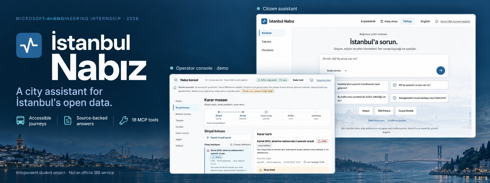
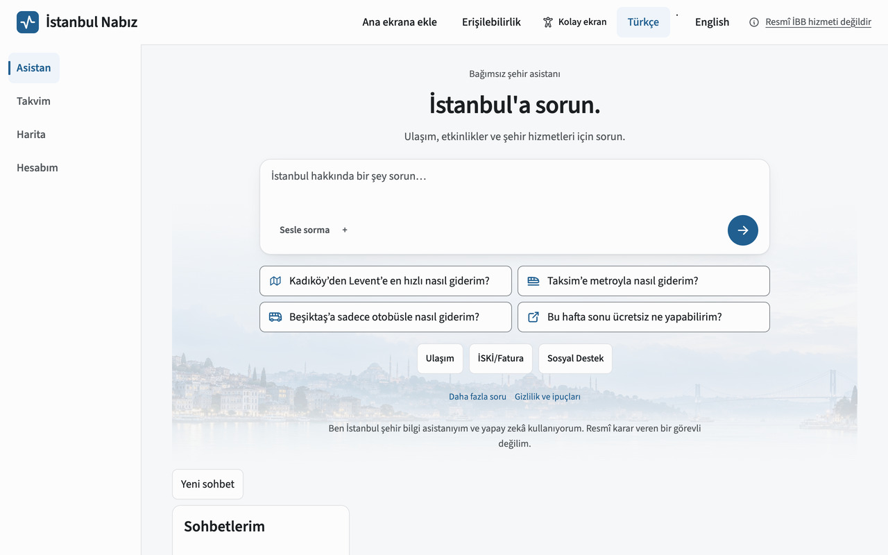
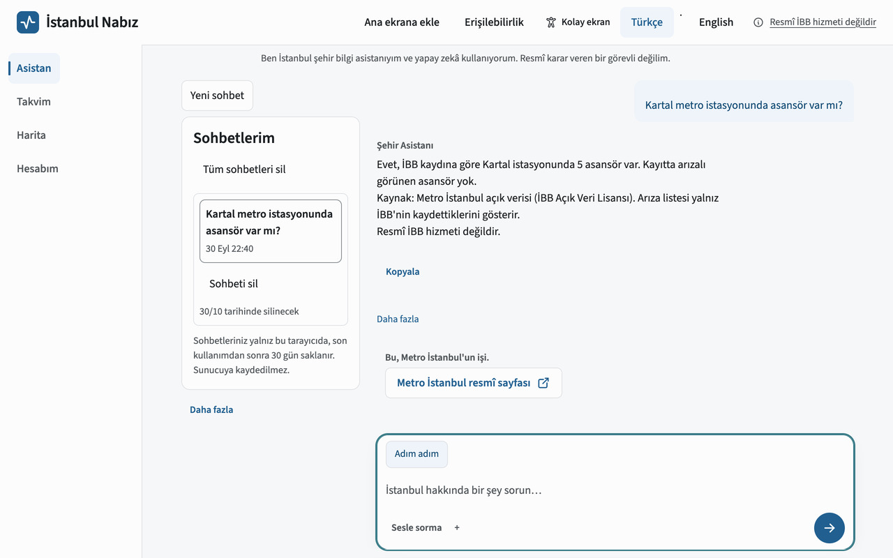
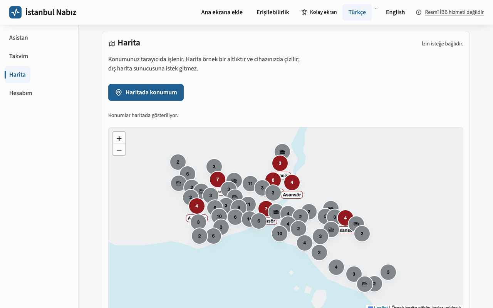
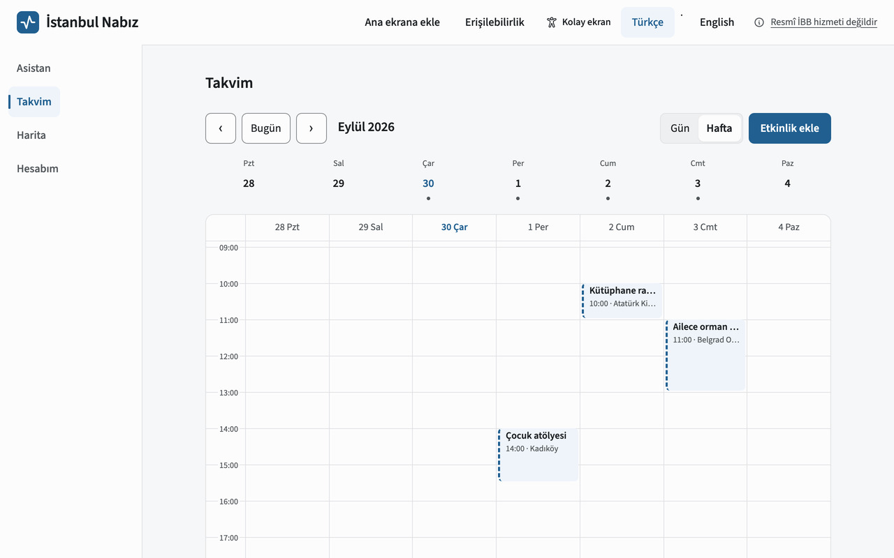
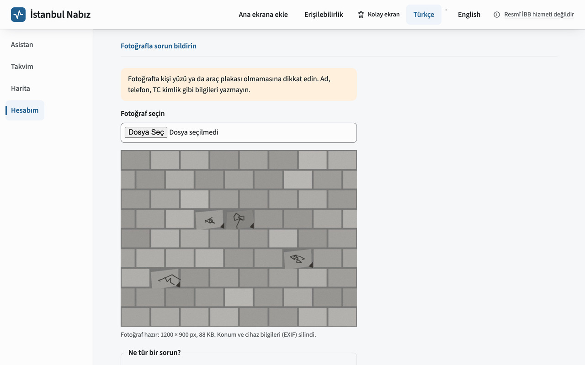
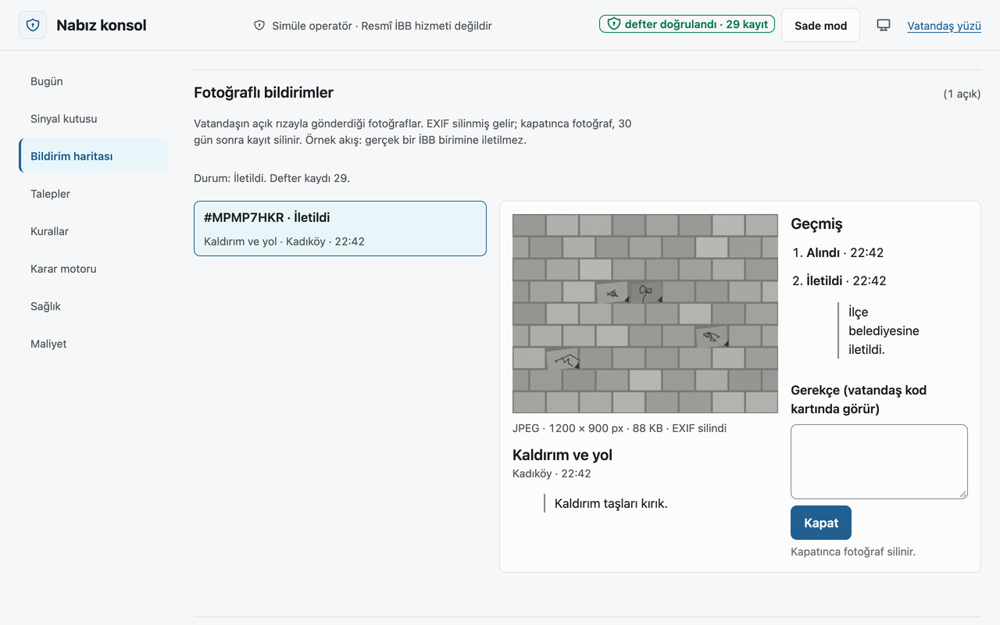
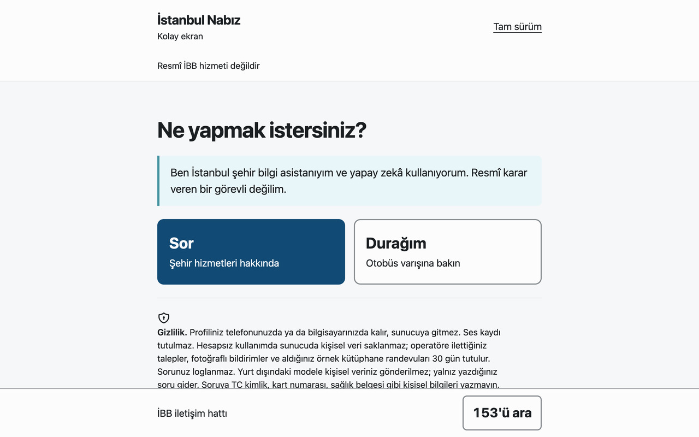
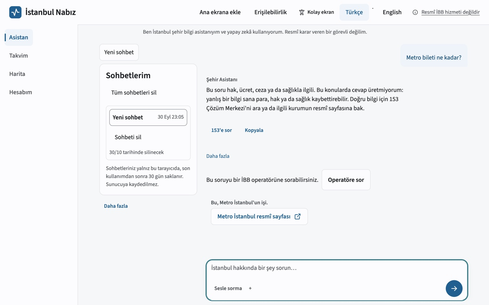

# İstanbul Nabız



**An unofficial city assistant for İstanbul, built on İBB's open data.** Ask a question in Turkish or
English, get a short answer that names its source. Underneath is an MCP server (`ibb-mcp`, 18 tools)
that any agent, GitHub Copilot included, can call.

[](https://github.com/muratcan-ates/istanbul-nabiz/actions/workflows/ci.yml)
[](LICENSE)
[](https://data.ibb.gov.tr/license)
[](pyproject.toml)

**Microsoft AI Innovators 2026:** [3-minute video](https://youtu.be/vw6Czi_nrNw) (Turkish) · [slides (PDF)](docs/sunum/istanbul-nabiz-sunum.pdf)

> **This is not an official İBB service.** İstanbul Nabız is an independent student project. It is not
> affiliated with, endorsed by or operated by the İstanbul Metropolitan Municipality (İBB), İETT, İSPARK
> or Metro İstanbul. Organisation names appear only to attribute the source of the data.
>
> Contains public sector information from the İstanbul Metropolitan Municipality Open Data Portal,
> licensed under the İBB Open Data Licence (CC BY 4.0): <https://data.ibb.gov.tr/license>.
> Full attribution, personal-data handling and rate-limit policy: **[NOTICE.md](NOTICE.md)**.

**Herkes için, her zaman, her yerde.** The starting question: can a wheelchair user find out whether a
metro station has a lift before leaving home? Accessibility is the product, not an add-on.

## Screenshots

All screenshots come from the running app (`make console-offline`, recorded data, no model).

<table>
  <tr>
    <td width="50%"><br><b>Assistant.</b> One question box, a few suggestions.</td>
    <td width="50%"><br><b>Answer with a source.</b> "Is there a lift at Kartal?" answered from the Metro İstanbul record.</td>
  </tr>
  <tr>
    <td width="50%"><br><b>Map.</b> Stations on a sample base map; red marks a station with a lift the record lists as out of service.</td>
    <td width="50%"><br><b>Calendar.</b> A week grid; plans can be saved as a calendar file.</td>
  </tr>
  <tr>
    <td width="50%"><br><b>Photo report.</b> Location and device data (EXIF) are removed before upload.</td>
    <td width="50%"><br><b>Operator console.</b> A person decides; every step is logged.</td>
  </tr>
  <tr>
    <td width="50%"><br><b>Easy-read screen.</b> Two large choices and a 153 button.</td>
    <td width="50%"><br><b>Knows its limits.</b> A fare question gets no generated answer; it points to 153, an operator and the official page.</td>
  </tr>
</table>

The photo in the report screenshot is synthetic. No screenshot shows a face, a number plate or personal data.

## What it does

- Answers city questions (metro lifts and service notices, car parks, bus stops and arrivals, traffic, air
  quality) from İBB open data and names the source in the answer. The page warns when a reading is old.
- Answers only with numbers that appear in a tool result. If it has no data, it says so.
- Sends questions about rights, fares, fines and health to İBB 153 instead of guessing.
- Takes a photo report of a city problem: removes EXIF, asks for consent, gives a tracking code.
- Lets an operator decide what happens to a report in a separate console; the citizen sees the result
  with the same code.
- Offers an easy-read screen, voice input, read-aloud answers, Turkish and English.
- Keeps chat history in the browser only, for 30 days after last use.
- Exposes the same 18 tools as an MCP server, so GitHub Copilot in VS Code can ask the same questions.

## How it works

```text
İBB open data (Metro İstanbul, İETT, İSPARK, traffic, air quality)
      ↓
One shared client + cache  (the İBB gateway starts returning 503 after about 15 fast calls)
      ↓
ibb-mcp: 18 tools, each result carries its source URL and reading time
      ↓                                   ↓
Nabız assistant (web page)          GitHub Copilot or any MCP client
      ↓
Number check: every number in the answer must be in a tool result
      ↓
Short answer + source
```

```text
Photo report (EXIF removed, consent, tracking code)
      ↓
Operator console: a person presses "İlgili birime ilet (örnek)"
      ↓
Entry in a hash-chained ledger
      ↓
The citizen sees "İletildi" with the same code
```

Every question to İBB goes through one rate-limited client and a cache with single flight, so many users
asking at once produce one upstream request. The assistant first applies fixed rules (emergency, refusal
topics), then calls tools, then checks the answer's numbers against the tool output. Without a model, rules
and templates write the answer; with a model configured, the model writes it and the same number check
applies. The API response says which one wrote it (`author`).

The photo report flow is a sample: nothing is sent to a real İBB office. More detail on the design and the
rules behind it: [docs/NABIZ.md](docs/NABIZ.md).

## Technologies

- Python 3.12, MCP Python SDK 2.x, httpx, pydantic
- FastAPI and uvicorn for the web app
- Plain HTML, CSS and JavaScript for the pages (design tokens from Fluent 2)
- The browser's own speech recognition and speech synthesis
- SQLite for the ledger and photo reports
- pytest and ruff
- Bicep and `azd` for Azure Container Apps (written, not deployed)
- Any OpenAI-compatible `/chat/completions` endpoint: Azure OpenAI, or Foundry Local on the device

## Quickstart

```bash
git clone https://github.com/muratcan-ates/istanbul-nabiz.git
cd istanbul-nabiz
make venv            # .venv on Python 3.12 (uses uv)
make install         # editable install with the dev and web extras
```

Run the app from recorded data. This needs no key, reads no `.env`, and makes no İBB call:

```bash
make console-offline   # http://127.0.0.1:8090  citizen page at /, operator console at /console, easy-read at /kolay.html
```

Other ways to run it:

```bash
make console           # same app; reads .env for model and service keys
make mcp               # the MCP server on stdio (what VS Code starts)
make mcp-http          # the MCP server on streamable HTTP (what Container Apps would run)
```

`NABIZ_OFFLINE=1` makes every source read from `tests/fixtures/`. Model settings (`NABIZ_LLM_*`) and all
other variables are listed in [docs/mcp-usage.md](docs/mcp-usage.md#configuration).

**Use it from GitHub Copilot.** `.vscode/mcp.json` already registers the server for VS Code as
`istanbul-nabiz` (it starts the `ibb-mcp` command on stdio). Open the folder after `make install`, start the
server from Copilot agent mode, and ask. Setup for other clients:
[docs/mcp-usage.md](docs/mcp-usage.md).

## Example questions

These work with `make console-offline`, without a model:

- *Kartal metro istasyonunda asansör var mı?* Answers "Evet" with the lift count from the Metro İstanbul
  record, adds "Kayıtta arızalı görünen asansör yok." and names the source (second screenshot).
- *Metro hattında arıza var mı?* Lists the service notices in the record, with its time.
- *Taksim istasyonunda asansör var mı?* Gives the lift count and lists each lift the record marks as out of
  service, with the status and date written in the İBB record.
- *Trafik nasıl?* The city traffic index from the recorded reading.
- *Beşiktaş'ta hava kalitesi nasıl?* The nearest station's reading and a health disclaimer.

To see it refuse:

- *Metro bileti ne kadar?* A fare question: no answer is generated; it points to 153 and the official page.
- *Japonya'nın başkenti neresi?* Out of scope: it says it cannot answer with its data and lists what it can.

## Design decisions

- **No source, no answer.** Every tool result carries its source URL and reading time. Tool results mark
  recorded data as "kayıtlı", never live.
- **Numbers must come from tools.** A number in the answer that is not in a tool result is rejected.
- **153 for rights, fares, fines and health.** These get no generated answer, from a model or a template.
- **Emergencies skip the model.** An emergency message opens a card that says Nabız cannot help and points
  to İBB 153. The call button shows a sample; it never dials.
- **A person decides.** In the operator console a person makes the decision, and every step is written to
  a hash-chained ledger.
- **Privacy.** Photo EXIF, XMP and ICC data are removed; consent is required; reports are deleted after 30
  days; a limit of 3 reports per hour. No user location is stored on the server ([docs/privacy.md](docs/privacy.md)).
- **Protect the shared gateway.** One client, one cache, and an İETT budget of 100 requests per hour.
- **The lift record is a record.** No fault in the record does not prove a lift works; the answer says so.

## Azure

Bicep files that deploy the MCP server to Azure Container Apps are written (`infra/main.bicep`,
`infra/modules/containerapps.bicep`, `azure.yaml`, `Dockerfile`), with a guide in
[docs/deploy.md](docs/deploy.md). **Nothing is deployed yet.** The model layer supports Azure OpenAI or any
`/chat/completions` endpoint, with Foundry Local as an on-device option. The model path has not been
measured on a real model; today's demo runs without one.

## Testing

```bash
make test           # the full suite, offline; any test that tries the network fails
make lint           # ruff
make guardrails     # plates, secrets, personal data, README numbers, broken links
make eval           # the journey scenarios, offline
```

Every number in the two tables below is written in the file its row names. `make guardrails` checks this.

## Results

| Metric | Result | Source |
|---|---|---|
| MCP tools | 18 | `eval/results/numbers.md` |
| Tests (28 Sep run) | 5,255 passed of 5,285 collected | same |
| Eval scenarios, offline | **66/66** passed (78 in the set, 12 agent-only skipped) | same |
| Agent without a model, numbers matching a tool result | **126/126** | `eval/results/20260908T082619Z-agent-offline.md` |
| Agent with a real model | n/a (not measured yet) | needs a model endpoint |
| Bus arrival error, untuned 120 s per stop | **12.94 min** mean absolute error (n = 1,351) | `eval/results/eta.md` |
| Calibrated rates on stops they never saw | 35.82 min against 10.18 min untuned, 523 predictions | same |

## Sayılar

Sunumda söylenen sayılar bu tablodan okunur.

| Ne | Değer | Kaynak |
|---|---|---|
| MCP aracı | **18** | `eval/results/numbers.md` |
| Test (28 Eylül koşusu) | **5.255** geçti (5.285 toplandı) | same |
| Eval senaryosu | **66/66** | same |
| Modelsiz ajanda kaynağıyla eşleşen sayı | **126/126** | `eval/results/20260908T082619Z-agent-offline.md` |
| Otobüs varış tahmininin ortalama hatası | **12,94 dk** (n = 1.351) | `eval/results/eta.md` |
| Ayarlı yöntem, görmediği duraklarda | 35,82 dk (ayarsız yöntem 10,18 dk, 523 tahmin) | same |

## Limitations

- **Not deployed.** Everything runs on a laptop; the Azure files are written but not used.
- **No real model measured.** The demo answers with rules and templates.
- **Recorded data in the demo.** `make console-offline` answers from recordings. The answer text from the
  API carries the recording time, but the citizen page does not show it yet.
- **Bus arrivals are estimates** and not accurate enough yet (see Results).
- **The lift record is not a guarantee.** It shows only what İBB recorded as out of service.
- **Step-by-step cards are not street navigation.** They come from the rail network and the lift record.
- **The map is a sample base map.** Coastlines are approximate, and no map tiles are requested from any
  server.
- **The photo flow is a sample.** Reports are not sent to a real İBB office.
- **History is thin.** "Usually at this hour" for car parks does not have enough data yet, and says so.
- **The page speaks Turkish and English only.**

## Key learnings

- **Measure before you claim.** A bus arrival calibration looked better on the data it was fitted on.
  On 523 later predictions at stops it never saw, it raised the error from 10.18 to 35.82 minutes, so the
  simpler untuned method stays in use ([eval/results/eta.md](eval/results/eta.md)).
- **Public APIs are shared.** The İBB gateway started failing after quick repeated calls; one client and a
  cache fixed that for every user at once.
- **Honest labels build trust.** Saying "recorded", "sample" and "not connected" costs nothing and keeps
  the demo true.

## Repository map

| Folder | What is there | Look here when |
|---|---|---|
| `src/ibb_mcp/` | the MCP server (`server.py`, 18 tools), tool layer, client, cache, İBB sources | adding data or a tool |
| `src/nabiz/console/` | the app: citizen page (`static/index.html`), easy-read screen, operator console, its API | changing a screen |
| `src/nabiz/agent/` | the city agent: rules, templates, number check, model client | changing how answers are written |
| `src/nexus_core/` | operator decisions and the hash-chained ledger | changing the operator flow |
| `tests/` | the offline test suite; `tests/fixtures/` holds recorded İBB answers | testing or running offline |
| `eval/` | scenarios, the eval runner, and measured results in `eval/results/` | checking a number |
| `data/reference/` | place list and derived profiles | place names or history |
| `missions/` | readable if-then rules for the operator flow | changing an operator rule |
| `infra/` | Bicep for Azure Container Apps (not deployed) | deploying |
| `kql/` | an Azure Data Explorer table schema for the collector (not used by the demo) | storing history |
| `scripts/` | gates and measurement scripts | running checks |
| `docs/` | Copilot setup, design, privacy, threat model, deploy guide, slides | reading more |

Every command is in the `Makefile` (`make help` lists them). [PLAN.md](PLAN.md) is the original sprint plan
and is partly out of date. Rules for contributors and coding agents: [AGENTS.md](AGENTS.md),
[CONTRIBUTING.md](CONTRIBUTING.md).
Every design choice and its reason: [DECISIONS.md](DECISIONS.md). Security: [SECURITY.md](SECURITY.md),
[docs/THREAT_MODEL.md](docs/THREAT_MODEL.md). Design language: [docs/design/DESIGN.md](docs/design/DESIGN.md).

## Licence and attribution

- **Code:** MIT, see [LICENSE](LICENSE).
- **Data:** İBB Open Data Licence (CC BY 4.0). *Contains public sector information from the İstanbul
  Metropolitan Municipality Open Data Portal.* Licence text: <https://data.ibb.gov.tr/license>.
- **Attribution, personal-data handling (bus number plates are dropped at the parsing boundary), and the
  politeness policy toward İBB's services:** [NOTICE.md](NOTICE.md).
- **No İBB, İETT, İSPARK or Metro İstanbul logo, emblem or other brand element is used anywhere in this
  project.** Organisation names appear only to attribute the source of the data.

## Acknowledgements

İBB's Department of Information Technologies and the Open Data Portal team publish these services openly;
this project exists because of that. Thanks also to İETT, İSPARK, Metro İstanbul and the İBB Traffic
Control Centre. Built for **Microsoft AI Innovators 2026**.

## Author

Muratcan Ateş · [github.com/muratcan-ates](https://github.com/muratcan-ates)

---

## Türkçe özet

**İstanbul Nabız**, İBB açık verisi üzerine kurulmuş, resmî olmayan bir şehir asistanıdır. Soruyu Türkçe ya
da İngilizce yazar veya söylersiniz; kaynağını söyleyen kısa bir cevap gelir. Örnek: "Kartal metro
istasyonunda asansör var mı?" Altında GitHub Copilot'un da çağırabildiği 18 araçlı bir MCP sunucusu
(`ibb-mcp`) vardır. Cevaptaki her sayı araç çıktısında olmalıdır; bilmediği konuda uydurmaz. Hak, ücret,
ceza ve sağlık sorularında cevap üretmez, 153'e yönlendirir. Fotoğrafla sorun bildiriminde EXIF silinir,
rıza alınır, takip kodu verilir; kararı operatör konsolunda bir insan verir. Azure Container Apps için Bicep
dosyaları yazıldı, henüz kurulmadı. Denemek için: `make console-offline`.

> **Bu resmî bir İBB hizmeti değildir.** Bağımsız bir öğrenci projesidir. İBB logosu veya marka öğesi
> kullanılmaz. Kamu sektörü bilgilerini içerir: İBB Açık Veri Portalı, İBB Açık Veri Lisansı (CC BY 4.0).
> Ayrıntı: [NOTICE.md](NOTICE.md).
