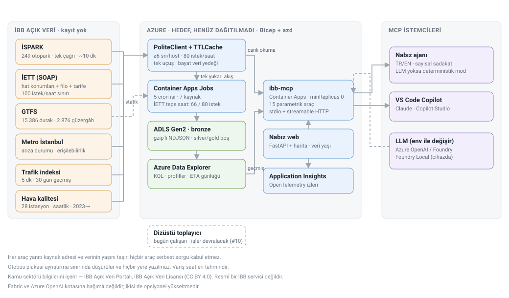
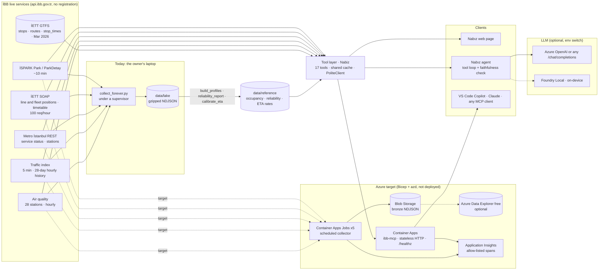

# İstanbul Nabız

**An unofficial MCP server and city agent over İstanbul's live open data** — parking, buses, metro, traffic and air quality, with a source URL and a timestamp attached to every number.

[](https://github.com/muratcan-ates/istanbul-nabiz/actions/workflows/ci.yml)
[](LICENSE)
[](https://data.ibb.gov.tr/license)
[](pyproject.toml)

> **This is not an official İBB service.** İstanbul Nabız is an independent student project. It is not
> affiliated with, endorsed by or operated by the İstanbul Metropolitan Municipality (İBB), İETT, İSPARK
> or Metro İstanbul. Organisation names appear only to attribute the source of the data.
>
> Contains public sector information from the İstanbul Metropolitan Municipality Open Data Portal,
> licensed under the İBB Open Data Licence (CC BY 4.0) — <https://data.ibb.gov.tr/license>.
> Full attribution, personal-data handling and rate-limit policy: **[NOTICE.md](NOTICE.md)**.

---

## What it does

İBB publishes many open datasets, 41 of them as APIs ([enumerated 13 Sep](docs/events_research.md)), behind
separate SOAP and REST endpoints. There is a Mobiett app, an İSPARK app, a CepHava app and a Metro İstanbul
app — but no single conversational surface, no open integration layer, and no history to answer *"how full
is it **usually** at this hour?"*.

Nabız turns those live endpoints into **one MCP server** (`ibb-mcp`, 17 tools) that any agent can call,
and ships a web page and a city agent as its first clients. Six journeys drive the design; each has six
eval scenarios in `eval/journeys.jsonl`:

| # | Who | The question | Tool chain | What the answer contains |
|---|---|---|---|---|
| **J1** | Driver | *"I'm reaching Taksim in 20 minutes — which car park will have space, and what does it cost?"* | `places_resolve` → `ispark_find_parking` → `ispark_typical_occupancy` | up to 5 car parks, live free spaces, tariff text as published, straight-line distance, "usually X% full at this hour" when the history supports it, update stamp |
| **J2** | Bus passenger | *"When does the 500T reach 4. Levent?"* | `iett_stops_search` → `iett_next_arrivals` | nearest vehicles, how many stops away, estimated minutes, how the estimate was derived, last position time, planned departure |
| **J3** | Metro passenger / accessibility | *"Any disruption on M4? Is there a lift at Kartal?"* | `metro_status` → `metro_station_info` | live disruption notices, lift / escalator / baby room / WC / prayer room per station |
| **J4** | Runner, parent | *"When is the air good enough for a run in Beşiktaş today?"* | `air_quality_now` → `air_quality_forecast` | current AQI and dominant pollutant, hourly PM10 outlook, best window, health note |
| **J5** | Commuter | *"Taksim to Kadıköy right now — car or metro? Do the 500Ts bunch at noon? Anything I should know about M4?"* | `plan_journey`, `line_reliability`, `check_alerts`, `traffic_index` | a mode comparison (never directions) with every assumption stated, measured headway history over a stated window, stateless alerts, today's traffic against its usual level |
| **J6** | Step-free traveller | *"Can I use the lift at Kartal right now? Which lifts are out on M2?"* | `metro_equipment_status` | lifts, escalators and moving walkways Metro İstanbul records as unusable, each with İBB's own type and recorded date; a station's lift state, never called "working", at most "no fault in İBB's record" |

**Three things make this more than an API wrapper:**

1. **It protects the upstream.** The İETT service documents a hard limit of 100 requests/hour and the İBB
   gateway starts 503-ing *every* service after roughly fifteen rapid calls. One shared rate-limited client
   plus a TTL cache with single-flight means N concurrent users produce at most one upstream request
   (`src/ibb_mcp/http.py`, `src/ibb_mcp/cache.py`); over HTTP each caller also has its own budget, priced by
   how far upstream a tool can reach (DECISIONS #15).
2. **It keeps the history İBB does not.** İBB publishes current state only. A collector archives parking
   occupancy, vehicle positions and its own arrival predictions, which is what makes "usually at this
   hour", line regularity and a *measured* ETA error possible at all.
3. **It never invents a number.** Every tool returns a `ToolResult` carrying provenance (source URL,
   observation time, whether the read was stale). When upstream fails the answer says how old the data is
   instead of guessing, an input that could not be read is reported as unknown rather than as good news,
   and the agent's faithfulness check rejects any number in an answer that is not in a tool result.

## Project status (23 September 2026)

Nothing is deployed yet. This table describes the working tree the README is committed with; the
day-by-day plan to delivery is [docs/SPRINT.md](docs/SPRINT.md), the live status table PLAN.md §0.

| Layer | State | Where |
|---|---|---|
| İBB client, cache, models, GTFS repair, ETA engine | **working**; arrivals serve the untuned 120 s/stop since 23 Sep, the estimator with the better held-out score ([DECISIONS #18](DECISIONS.md)) | `src/ibb_mcp/{http,cache,models,gtfs,eta}.py`, `src/ibb_mcp/eta_profile.py` |
| 17 MCP tools behind one façade, plus the `ibb://attribution` resource | **working** — offline tests, and a real MCP client over stdio (`tests/test_mcp_integration.py`) | `src/ibb_mcp/tools.py`, `src/ibb_mcp/server.py` |
| MCP over streamable HTTP | **working locally** — stateless, per-caller budget, optional API key, closed CORS, `/healthz`; not deployed | `src/ibb_mcp/server.py`, `tests/test_server_security.py` |
| Derived tables | **committed, thin** — built on 13 Sep from the laptop's lake; see Results for what each supports | `data/reference/` |
| Collector | **today:** the owner's laptop, under a supervisor; its lake holds watched-line snapshots on 4 of the 15 days from 8 to 22 Sep (DECISIONS #10). **Target:** five scheduled Container Apps Jobs, written and tested offline, not deployed | `scripts/collect_forever.py`, `src/nabiz/collector/job.py`, `infra/modules/collectorjobs.bicep` |
| Web UI | **working locally** — every card shows the data's age; Content-Security-Policy; the alert check travels in a POST body; native ES modules since 23 Sep. A redesign is approved and specified, not built yet ([below](#the-web-page-and-its-design)) | `src/nabiz/web/`, [docs/design/](docs/design/DESIGN.md) |
| Alerts | **working** — stateless engine behind the MCP tool and the web route; the page can check and reset a subscription but has no editor to create one yet | `src/ibb_mcp/alerts/`, [docs/privacy.md](docs/privacy.md) |
| City agent | **working without a model** (keyword routing and templated answers); the model path has never been evaluated on a real model | `src/nabiz/agent/` |
| Infrastructure | **written, never deployed** — Bicep + `azd`, one `Dockerfile` for server and jobs (never built) | `infra/`, `azure.yaml`, `Dockerfile`, [docs/deploy.md](docs/deploy.md) |
| CI | **green on `main` since 23 Sep** (`1599c40`, then `d59b5a8`), after 13 red runs from 8 to 22 Sep, 10 of them because three tests read the gitignored GTFS export ([docs/ENGINEERING.md](docs/ENGINEERING.md) §1). Lint, tests, the MCP smoke test, guardrails, the architecture fences, the web budget and the authorship gate; `make ci-local` runs the same list on a clean copy. `main` is not protected yet | `.github/workflows/ci.yml` |
| Tests | **1250 passed**, 1 skipped, 4 xfailed (two documented defects, and the İETT hourly budget that waits for an owner decision), offline, on 23 Sep, in the working tree and on the clean copy `make ci-local` builds | `tests/` |
| Eval harness | **36 scenarios** (J1–J6). The committed results are the 24-scenario runs of 8 Sep; J5 and J6 have no committed run yet | `eval/` |

## Architecture



Read it left to right: six İBB endpoints, one rate-limited client they all pass through, a collector that
keeps the history İBB does not, and one tool layer that the MCP server, the web page and the agent all
call. The Azure half is the **target**, written in `infra/` but not deployed; today the collector runs on the
owner's laptop (the dashed box). The mermaid source below says the same thing for readers who prefer text.


```mermaid
flowchart LR
  subgraph IBB["İBB live services (api.ibb.gov.tr, no registration)"]
    P[İSPARK Park / ParkDetay<br/>~10 min]
    B[İETT SOAP<br/>line and fleet positions · timetable<br/>100 req/hour]
    G[(İETT GTFS<br/>stops · routes · stop_times · Mar 2026)]
    M[Metro İstanbul REST<br/>service status · stations]
    T[Traffic index<br/>5 min · 28-day hourly history]
    AQ[Air quality<br/>28 stations · hourly]
  end
  subgraph NOW["Today: the owner's laptop"]
    LC[collect_forever.py<br/>under a supervisor]
    LL[(data/lake<br/>gzipped NDJSON)]
  end
  subgraph AZ["Azure target (Bicep + azd, not deployed)"]
    J[Container Apps Jobs x5<br/>scheduled collector]
    BL[(Blob Storage<br/>bronze NDJSON)]
    K[(Azure Data Explorer free<br/>optional)]
    MCP[Container Apps<br/>ibb-mcp · stateless HTTP · /healthz]
    AI[Application Insights<br/>allow-listed spans]
  end
  REF[(data/reference<br/>occupancy · reliability · ETA rates)]
  TL[Tool layer · Nabiz<br/>17 tools · shared cache · PoliteClient]
  subgraph CL["Clients"]
    WEB[Nabız web page]
    AG[Nabız agent<br/>tool loop + faithfulness check]
    VS[VS Code Copilot · Claude · any MCP client]
  end
  subgraph LLM["LLM (optional, env switch)"]
    AO[Azure OpenAI or any /chat/completions]
    FL[Foundry Local · on-device]
  end
  P & B & M & T & AQ --> LC --> LL
  P & B & M & T & AQ -. target .-> J --> BL -.-> K
  LL -->|build_profiles · reliability_report · calibrate_eta| REF
  P & B & M & T & AQ --> TL
  G --> TL
  REF --> TL
  TL --> MCP --> VS
  TL --> WEB
  TL --> AG
  AG --> AO
  AG -.-> FL
  MCP & J --> AI
```

The MCP server is the product; the page and the agent are its first customers. All three read the same
cached, provenance-stamped tool layer, so a question asked in VS Code Copilot and the same question asked on
the Nabız page hit identical code and identical numbers. See [DECISIONS.md](DECISIONS.md) for why each box
is what it is — #10 for the collector's move to Container Apps Jobs, #14 for the rail graph behind the mode
comparison.

## Results

Every number below is copied from a file in `eval/results/` or `data/reference/`, and the file is named in
the row. A fit scored on the data it was fitted on is labelled **in-sample** and is never presented as
accuracy. Where a metric cannot be computed it says so and why.

| Metric | Result | Source · how it is measured |
|---|---|---|
| Task success rate (data layer) | **24/24** offline · **13/13** live | `eval/results/20260908T084817Z-deterministic-offline.md` · `eval/results/20260908T084908Z-deterministic-live.md` (= `latest.md`), 8 Sep, J1–J4. A scenario passes when every call returns or refuses where it should and every required field is present. The live run stopped at its own 8-request ceiling after 13 scenarios; the J5 scenarios added on 23 Sep are in no committed run yet |
| Tool success rate | 34/34 offline · 19/19 live | same two files |
| Number-plate leaks | **0** | same two files; also asserted by the tests and by `scripts/guardrails.py` |
| Bus ETA mean absolute error | **12.94 min** (n = 1,351 of 6,801 predictions, 8–22 Sep) — *not shippable, see below* | `eval/results/eta.md` (`make eta`): every logged prediction paired with the vehicle later observed at that stop. All of them used the untuned 120 s/stop |
| — within 5 minutes | 27.3% | same |
| — by method | `stop_sequence` 12.74 min (n = 1,240) · `distance` 15.16 min (n = 111) | same |
| Calibrated ETA rates, held out | **35.82 min** against 10.18 min for the untuned rate, on the same 523 predictions made after the fit | `eval/results/eta.md`, "Held-out replay" (`make eta-holdout`): the calibration makes the estimate worse on stops it never saw |
| Calibrated ETA rates, in-sample | 11.16 min for the per-bucket rates (served only in the calibrated mode, see below), 12.37 min for the single 235 s/stop rate, both on the 500 predictions they were fitted on — fits, not accuracy | `eval/results/eta.md` ("What 12.37 and 11.2 are") · `data/reference/eta_profile.json` (`overall.mae_minutes`) |
| Line regularity | 15 of 39 line-hour cells published, 24 refused for too few observations; 2 calendar days (8 and 13 Sep) | `eval/results/reliability.md`, `data/reference/line_reliability.json` |
| "Usually at this hour" parking | 0 of 3,216 cells pass the profile's own guards (16,325 snapshot rows, 8–13 Sep), so the tool answers "not enough history yet" | `data/reference/occupancy_profile.json` |
| Agent without a model | 9/24 scenarios; tool-call accuracy 41.7% exact chain; numeric faithfulness 126/126 numbers in its templated answers | `eval/results/20260908T082619Z-agent-offline.md` — keyword routing and templates, not a model |
| Agent with a model | n/a — never evaluated on a real model | needs an LLM endpoint (DECISIONS #5) |
| p95 end-to-end latency | 27 ms offline · 17,819 ms live, cold | `eval/results/20260908T084817Z-deterministic-offline.md` · `eval/results/20260908T084908Z-deterministic-live.md`; live includes our own ≥ 6 s spacing before each upstream call — politeness, not İBB being slow |
| Data freshness at answer time | 48 s median, live | `eval/results/20260908T084908Z-deterministic-live.md`, age of the reading itself (`provenance.reported_at`) |

**About that ETA number.** 12.94 minutes is bad and it is published anyway, because the harness exists to
catch exactly this. It measures the untuned 120 s/stop estimator: the collector logs every prediction at
that rate. The per-bucket rates calibrated on 13 September scored 11.16 minutes
only on the 500 predictions they were fitted on (two 500T stops; the single 235 s/stop rate scored 12.37
there); replayed on 523 later predictions at stops the fit never saw, they scored 35.82 minutes against
10.18 for the untuned rate. Seconds per stop belongs to a stretch of road, not
to a line, so the next model has to account for stop spacing. Since 2026-09-23 `iett_next_arrivals` and the
bus leg of `plan_journey` serve the untuned 120 s/stop, the estimator with the better held-out score, and the
calibrated rates only with `NABIZ_ETA_PROFILE_MODE=calibrated` (DECISIONS #18). Every arrival says which rate
it used and why (`diagnostics.rate_mode`, `rate_reason`).
Method, the before/after split, limits and history: `eval/results/eta.md`.

## Verified data facts

Every row here was confirmed by a real call on **7–8 September 2026**; the recorded responses (trimmed
samples) are committed in `tests/fixtures/` alongside `_capture_report.json` (URL, status, byte count,
latency per call). This section exists because the interesting engineering in a public-data project is
rarely the happy path.

| Source | Endpoint | Returns | Refresh | Trap — and where it is handled |
|---|---|---|---|---|
| İSPARK lots | `GET /ispark/Park` | 249 car parks: `parkID, parkName, lat, lng, capacity, emptyCapacity, workHours, parkType, freeTime, district, isOpen` | ~10 min | `lat`/`lng` arrive as **strings**; one call covers the whole city, so "parking near me" is a filter over a shared cached fetch, never a per-user request — `sources/ispark.py` |
| İSPARK detail | `GET /ispark/ParkDetay?id=<parkID>` | adds `updateDate`, `monthlyFee`, `tariff` (free text), `address`, `areaPolygon` (WKT) | ~10 min | **An unknown id returns a plausible dummy record** (capacity 1) instead of an error, so ids are validated against the live list before the call. The tariff text is shown verbatim, never parsed — `sources/ispark.py` |
| İETT line positions | `POST .../SeferGerceklesme.asmx`, action `GetHatOtoKonum_json` | vehicles on one line (31 for 500T at capture): `kapino, boylam, enlem, guzergahkodu, hatad, yon, son_konum_zamani, yakinDurakKodu` | seconds | The JSON is an **XML-entity-escaped string inside `<…Result>`**, and Oracle `ORA-` errors leak through as plain text in the same element — `http.extract_soap_json` |
| İETT fleet | same service, `GetFiloAracKonum_json` | 6 911 vehicles, 1.1 MB: `Operator, Garaj, KapiNo, Saat, Boylam, Enlem, Hiz, Plaka` | seconds | **Documented limit: 100 requests/hour.** Our own budget stops at 80/hour before İBB does. `Plaka` (number plate) is dropped at the parsing boundary and never stored or returned; the recorded fixtures carry synthetic plates (`00 XX 001` …) — `http.HourlyBudget`, `models.BusPosition.from_fleet_raw`, [NOTICE.md](NOTICE.md) |
| İETT timetable | `.../PlanlananSeferSaati.asmx`, `GetPlanlananSeferSaati_json` | 702 planned departures for 500T: `SHATKODU, SGUZERAH, SYON, SGUNTIPI (I/C/P), DT` | daily | Day type is a single letter — `I` weekday, `C` Saturday, `P` Sunday — and it is a **departure** from the terminus, not an arrival at your stop; the ETA engine labels it as such — `models.day_type_for`, `eta.py` |
| İETT GTFS | `data.ibb.gov.tr` dataset `iett-gtfs-verisi` | 15 390 stops, 9 279 routes (Mar 2026) | ~6 months | Separator is **`;`**, file has a **UTF-8 BOM**, coordinates carry thousands separators (`410.191.700.005.564` = `41.0191700005564`, 4 stops still land outside İstanbul and are dropped), and `routes.csv` text is **double-encoded mojibake** (`KADIKÖY` = `KADIKÖY`) — `models.repair_coordinate`, `models.demojibake`, `gtfs.py` |
| **The join** | live → static | `yakinDurakKodu` → `stops.**stop_code**` (31/31 matched on 500T); `guzergahkodu` → `routes.route_code` (2/2) | — | It is `stop_code`, **not** `stop_id` — different number spaces in this export. Joining on `stop_id` matches nothing and the ETA tool would quietly answer "no buses" — `gtfs.py` |
| Metro status | `GET .../V2/GetServiceStatuses` | `{Success, Error, Data:[{LineId, LineName, Description, IsActive, UpdateDate, …}]}` | live | Only lines **with a notice** are listed. An empty `Data` means "no disruption reported", not "no data" — and `Success: false` is a real failure, not an empty result — `sources/metro.py` |
| Metro stations | `GET .../V2/GetStations` | 248 stations with `DetailInfo:{Escolator, Lift, BabyRoom, WC, Masjid, Latitude, Longitude}` | static | The escalator field is misspelled **`Escolator`**; `Name` is shouted and de-diacriticised (`YENIKAPI`) while `Description` holds the human form (`Yenikapı`) — display uses `Description` — `sources/metro.py` |
| Traffic index | `GET /tkmservices/api/TrafficData/v1/TrafficIndexHistory/{days}/{5M\|H\|D\|M\|Y}` | `[{TrafficIndex: 1–99, TrafficIndexDate}]`; `/1/H` returns 25 points | 5 min | **Returns XML unless `Accept: application/json` is sent** — without the header JSON parsing fails with a confusing error. The 25-point shape gives "now vs. same hour yesterday" from a single call. A missing index is kept as missing, never read as 0 ("akıcı") — `sources/traffic.py`, `models.TrafficIndexPoint` |
| Air quality | `GetAQIStations` (28) · `GetAQIByStationId?StationId=<guid>&StartDate=dd.MM.yyyy HH:mm:ss&EndDate=…` | hourly `Concentration{PM10, SO2, O3, NO2, CO}` + `AQI{AQIIndex, ContaminantParameter, State, Color}`, back to at least 2023 | hourly | **`AQIIndex` is a rolling 24-hour mean for PM10**, so it lags the air you would breathe on a run — for short-horizon questions the hourly *concentration* is the honest signal. `EndDate` is inclusive (dedupe on `ReadTime`); a 30-day window returned all 744 rows; **PM2.5 is not in this API**; NO2/CO are frequently null — `sources/airquality.py` |

Re-capture the fixtures with `make fixtures` (**NETWORK**, owner only). It spaces gateway calls ≥ 7 s apart,
makes at most three İETT SOAP calls and swaps every plate for a synthetic one before writing. **Run it
sparingly** — the budget it protects is shared with everyone else using these public endpoints.

## Quickstart

```bash
git clone https://github.com/muratcan-ates/istanbul-nabiz.git
cd istanbul-nabiz

make venv          # uv venv -p 3.12 .venv (the system 3.14 is not supported by every dependency yet)
make install       # editable install with the dev and web extras (EXTRAS=dev,web,collector for more)

make test          # the suite, offline: tests/conftest.py fails any test that tries the network
make lint smoke guardrails   # the other gates CI runs, with:
make architecture web-budget # import layers and size ratchets; the page's byte, font and token budget
make ci-local      # every CI gate on a clean copy of exactly what a push would publish
```

**Reference data.** Committed: `data/reference/places.csv` (276 places: metro stations, air-quality
stations, district centroids, landmarks; `make places` rebuilds it), the three derived tables
(`occupancy_profile.json`, `line_reliability.json`, `eta_profile.json`, rebuilt from the local lake by
`scripts/build_profiles.py`, `scripts/reliability_report.py` and `scripts/calibrate_eta.py`), and a 38 KB
cut of the GTFS export in `tests/fixtures/gtfs_mini/` that the tests read. The full GTFS export is *not*
committed; download it into `data/reference/gtfs/` with `ibb_mcp.gtfs.download_gtfs` (resource URLs in
`tests/fixtures/gtfs_resources.json`) and build its stop-sequence cache with `make sequences`. Without it
the two stop tools answer `reference_data_missing` and `plan_journey` withdraws its bus option.

**Offline mode.** `NABIZ_OFFLINE=1` makes every source read from `tests/fixtures/` instead of the network,
which is how the demo stays reproducible on a bad conference wifi. Every other setting is listed in
[docs/mcp-usage.md](docs/mcp-usage.md#configuration).

**Check the environment.** `scripts/probe_day0.py` is the pre-flight gate: 21 numbered checks over the
local toolchain, the Azure subscription's regional constraints, the six İBB endpoints and the live-bus →
GTFS join, printed as a PASS/FAIL/SKIP table and written to `docs/day0_report.json` (home paths shortened
to `~`; no subscription or tenant id is recorded).

```bash
./.venv/bin/python scripts/probe_day0.py --no-network  # local checks only, safe to re-run
./.venv/bin/python scripts/probe_day0.py               # NETWORK: + İBB and GTFS (6 gateway calls, spaced)
./.venv/bin/python scripts/probe_day0.py --azure       # NETWORK: + the az subscription checks
```

**Run the MCP server.** `ibb-mcp` is the console script declared in `pyproject.toml`; it registers the 16
tools below and an `ibb://attribution` resource.

```bash
make mcp                                  # stdio, the shape VS Code and Claude launch
.venv/bin/ibb-mcp --offline               # stdio, served from tests/fixtures (reproducible demo)
make mcp-http                             # streamable HTTP on 127.0.0.1:8000, the shape Container Apps runs
NABIZ_OFFLINE=1 make web                  # the web page on http://127.0.0.1:8080, from fixtures
make console                              # the product app on http://127.0.0.1:8090: citizen face at /, simulated operator at /console
NABIZ_OFFLINE=1 make console              # the same, from recordings only (no İBB call)
make console-offline                      # the same from recordings, without reading .env or probing a model (CONSOLE_PORT=8090)
```

The product app (`python -m nabiz.console`) reads `.env`, binds the decision core (`nexus_core`, ledger in
`data/nexus/nexus.db`, rules in `missions/*.toml`) and feeds it the Metro equipment snapshot and a small city
watch (car parks, air quality, one bus line) when the console's queue is read, at most every 300 s. Without a
model the Arena's three seats are rule-based and say so; with `NABIZ_LLM_*` set, each seat is one model call
over the card's evidence, on the Arena's own daily ceiling. `POST /api/console/simulate` replays a recorded
signal, never live data. The console answers only on this machine unless `NABIZ_CONSOLE_TOKEN` is set; then
`/console` asks for that key (DECISIONS #25).

| Tool | What it answers |
|---|---|
| `places_resolve(query, limit)` | a place name → coordinates, from the local gazetteer |
| `ispark_find_parking(place \| lat+lon, radius_km, min_free, open_now)` | car parks near a place with live free spaces and the tariff as published |
| `ispark_typical_occupancy(park_id, weekday, hour)` | measured occupancy history for one car park, or why there is not enough |
| `iett_stops_search(query, limit)` | bus stops by name, from GTFS |
| `iett_line_buses(line_code, direction)` | where a line's buses are now; with the GTFS export present, a code İETT does not list is refused before it costs an İETT request |
| `iett_next_arrivals(line_code, stop, limit)` | estimated arrivals, each with its method and confidence; a stop the line never calls at is refused, and so is a code İETT does not list (with the GTFS export present) |
| `metro_status(line)` | live disruption notices; no notice means none reported |
| `metro_station_info(name)` | a station's lift, escalators, baby room, WC and prayer room |
| `metro_equipment_status(station, line, group)` | lifts, escalators and moving walkways Metro İstanbul records as unusable, with İBB's type and recorded date (meaning undocumented), a station's lift state and uncertainty codes; never "working" |
| `traffic_index(window)` | the city traffic index now, against the same weekday and hour's median, or its last 24 hours |
| `air_quality_now(place)` | the nearest station's latest reading, AQI band and a health disclaimer |
| `air_quality_forecast(place, horizon_hours)` | a baseline PM10 outlook and the cleanest upcoming window |
| `city_freshness()` | how old each source's data is, and how much request budget is left |
| `plan_journey(origin, destination \| lat+lon pairs)` | drive, metro, one bus line and walking compared, with every assumption; not navigation |
| `line_reliability(line_code, hour)` | measured headway and bunching for a line and hour, over a stated window |
| `check_alerts(subscription)` | a client-held alert subscription evaluated once, stored nowhere |

The same tools are callable directly from Python, which is how the contract tests drive them:

```python
import asyncio
from ibb_mcp.tools import Nabiz

async def main() -> None:
    nabiz = Nabiz()
    result = await nabiz.ispark_find_parking(place="Taksim", radius_km=1.0)
    print(result.data["count"], "car parks;", result.provenance.source_url)
    await nabiz.aclose()

asyncio.run(main())
```

## Use it from your own Copilot

`ibb-mcp` is a plain MCP server: point VS Code / GitHub Copilot agent mode, Claude Desktop, Claude Code or
any other MCP client at it and İBB's live data becomes available to *your* agent, with the same caching and
the same provenance.

**→ [docs/mcp-usage.md](docs/mcp-usage.md)** — copy-pasteable stdio and HTTP configuration, the full tool
reference with parameters and return shapes, the failure kinds, and a note on sharing the rate budget.

## The web page and its design

The page is the MCP server's first client: type a question or tap an example, and the answer comes from
İBB's endpoints with the age of every number beside it. Its redesign, **"Nabız çizgisi"**, is approved and
written down in **[docs/design/DESIGN.md](docs/design/DESIGN.md)**:

- **One living element.** A pen line drawn from the last 24 hours of İBB's city traffic index, computed only
  from real readings. It breathes only while the data is current; older data draws grey, with its date.
- **Colour from measurement.** Base hue 260, the centre of İBB's and İETT's web blues in OKLCH; one
  analogous cyan accent that means "now" and nothing else; warm hues only for warnings and polluted air.
  178 palette pairs and 76 added pairs pass WCAG AA contrast in both themes.
- **Type and icons.** Atkinson Hyperlegible Next, drawn to keep codes such as `M1A` and Turkish `İ ı` apart
  (it has no `₺`, `µ` or subscript glyphs; Source Sans 3 has all of them, so the choice is open again:
  DESIGN.md §4), and Tabler Icons: open licences, self-hosted, nothing hand-drawn.
- **Honesty rules.** Never look like an official İBB product; "resmî değildir" at every width; every number
  with its age; no invented point in any drawing.

Steps 0 to 2 of its plan are in the tree: the before measurements, the budget gate, and the old `app.js`
split into ES modules, plus the fixes a review asked for on the same day (the data-age strip and status
now show how old the data is, not when it was last read; readable greys; keyboard focus kept on "Sor";
Turkish names on the map). The page still has its old look, so it is not pictured here until the visual
steps land; the gate already lists every finding each of them has to remove.

## How this repository is built

One person, several coding agents working in parallel lanes, and rules that keep the result honest:

- **[AGENTS.md](AGENTS.md)** — the binding rules for any agent: lanes and file ownership, no AI
  attribution, nothing personal in a public tree, never call İBB from tests, sourced numbers only.
- **[CONTRIBUTING.md](CONTRIBUTING.md)** — setup, the checks, commit style and identity.
- **[docs/ENGINEERING.md](docs/ENGINEERING.md)** — the engineering rules, each tied to an incident or a
  reference, and a dated, unflattering self-assessment.
- **Gates on the code's shape and cost** (ENGINEERING §13 and §14), all three in CI: `make architecture`
  fences the import layers (`ibb_mcp` never imports `nabiz`) and ratchets module, class and function size
  against `scripts/architecture_baseline.json`, so measured debt cannot grow past its entry (raising an entry
  is a reviewed change); `tests/test_performance_budgets.py` counts upstream calls per tool at the cache and
  at the boundary (zero when the cache is warm), single flight, stale-on-error and parses per process; `make web-budget` holds the page to its byte, font, motion and colour-token budgets.
- **[docs/THREAT_MODEL.md](docs/THREAT_MODEL.md)** and **[SECURITY.md](SECURITY.md)** — what is protected,
  by which file, and how to report a vulnerability privately.
- **[docs/privacy.md](docs/privacy.md)** — why no location is stored server-side, and the tests that hold it.
- **[docs/SPRINT.md](docs/SPRINT.md)** · **[PLAN.md](PLAN.md)** · **[DECISIONS.md](DECISIONS.md)** — the
  plan to delivery, the original plan with its dated status, and 19 architecture decisions.

## Limitations

Stated plainly, because a public-data project that hides these is not trustworthy:

- **Bus arrivals are estimates, not a timetable guarantee**, and today they are not accurate enough (see
  Results). They come from live vehicle positions, GTFS stop order and the published schedule; each
  estimate reports the method behind it. Plan journeys with official İETT and Metro İstanbul sources.
- **The mode comparison is an estimate, not navigation.** Rail runs over Metro İstanbul's station list with
  a flat 6-minute headway and one published check (M7: 38.9 min modelled against 36 published); the drive
  estimate has no ground truth. Every option says so ([docs/route-advisor.md](docs/route-advisor.md)).
- **The history is thin.** The derived tables were built on 13 September from a collector that ran on a
  laptop and kept stopping: no parking cell passes its own guards yet, and line regularity covers two days.
  The tools say so instead of extrapolating.
- **28 air-quality stations, not 38.** The open API exposes 28; İBB's own map shows more. Coverage is
  uneven, so the nearest station may be some distance from you.
- **No PM2.5.** This API publishes PM10, SO2, O3, NO2 and CO only. NO2 and CO are frequently null.
- **The published AQI is a rolling 24-hour mean** for PM10 (8 hours for O3 and CO). It is the official
  band, but it is not what the air is doing this hour — the hourly concentration is reported next to it.
- **Air-quality forecasting is a seasonal-naive baseline**, and the result says so.
- **İSBİKE is out.** The bike-share service is closed; there is nothing live to read.
- **The traffic *density* dataset stops in January 2025.** Only the live 1–99 traffic *index* is current.
- **Parking occupancy is not instantaneous** — İSPARK refreshes roughly every 10 minutes, and every answer
  carries the age of the reading.
- **Some upstreams need a key or are shut** — hal (market) prices require a key, road-works returns 404.
- **The offline eval still needs the GTFS export for its bus-stop scenarios.** The tests run on a committed
  GTFS cut, but `eval/run_eval.py --offline` reads `data/reference/gtfs/`; on a clean clone without it four
  J2 scenarios fail (26/30, measured on a clean copy on 23 Sep).
- **The free Azure Data Explorer cluster has no SLA**, and the Azure for Students credit behind the rest of
  the deployment is finite; nothing is deployed yet.

## Roadmap

| | |
|---|---|
| **Deploy** | the MCP server and the collector jobs on Azure Container Apps ([docs/deploy.md](docs/deploy.md), [docs/SPRINT.md](docs/SPRINT.md) D3) |
| **A better ETA model** | one that accounts for stop spacing, measured held out before it is served |
| **Publish `ibb-mcp` to PyPI** | one `uvx ibb-mcp` away from any MCP client, once the release name is decided |
| **Specialised agents** | a transit agent, a parking agent and an environment agent behind a router, instead of one prompt holding fourteen tools |
| **Push notifications** | for the stateless alert check, which today runs only while the page is open |
| **Copilot Studio connector** | the same server as a first-class Microsoft 365 agent tool |
| **Microsoft Fabric** | Eventhouse mirror of the ADX tables and a OneLake shortcut over the lake |
| **Event Hubs ingestion** | in place of the scheduled collector for the second-resolution fleet feed |
| **Azure Maps Search** | as a fallback for place names the local gazetteer misses |
| **LightGBM occupancy model** | once two or more weeks of parking history exist, measured against the median profile |

---

## Türkçe

**İstanbul Nabız**, İBB'nin kayıt istemeyen canlı açık verisini (İSPARK doluluk, İETT otobüs konumları,
Metro arıza durumu, trafik indeksi, hava kalitesi) **17 araçlı tek bir MCP sunucusuna** dönüştürür; bir web
sayfası ve bir şehir ajanı bu sunucunun ilk müşterileridir. Her sayının yanında kaynağı ve zaman damgası vardır.

> **Bu resmî bir İBB hizmeti değildir.** Bağımsız bir öğrenci projesidir; İBB, İETT, İSPARK veya Metro
> İstanbul ile bağlantılı, onlar tarafından desteklenen ya da onaylanan bir çalışma değildir. Ayrıntı:
> [NOTICE.md](NOTICE.md).
>
> Kamu sektörü bilgilerini içerir — İBB Açık Veri Portalı, İBB Açık Veri Lisansı (CC BY 4.0).

**Beş kullanıcı yolculuğu**

| # | Kullanıcı | Soru | Araç zinciri |
|---|---|---|---|
| J1 | Sürücü | *"Taksim'e 20 dakikaya varıyorum, hangi otoparkta yer olur, ücreti ne?"* | `places_resolve` → `ispark_find_parking` → `ispark_typical_occupancy` |
| J2 | Yolcu | *"500T 4. Levent'e ne zaman gelir?"* | `iett_stops_search` → `iett_next_arrivals` |
| J3 | Metro yolcusu | *"M4'te arıza var mı? Kartal'da asansör var mı?"* | `metro_status` → `metro_station_info` |
| J4 | Koşucu, ebeveyn | *"Beşiktaş'ta bugün koşu için hava ne zaman uygun?"* | `air_quality_now` → `air_quality_forecast` |
| J5 | İşe giden | *"Taksim'den Kadıköy'e şu an arabayla mı metroyla mı? 500T öğlen kümeleniyor mu?"* | `plan_journey`, `line_reliability`, `check_alerts`, `traffic_index` |
| J6 | Adımsız yolculuk | *"Kartal'da asansörü şu an kullanabilir miyim? M2'de hangi asansörler kullanılamıyor?"* | `metro_equipment_status` |

**Neden bir API sarmalayıcısından fazlası**

- **Servisleri korur.** İETT servisi saatte 100 istekle sınırlı; İBB ağ geçidi yaklaşık 15 hızlı çağrıdan
  sonra bütün servislere 503 döndürüyor. Tek istemci + tek uçuşlu (single-flight) TTL önbellek sayesinde
  eşzamanlı N kullanıcı en fazla bir yukarı akış isteği üretir; HTTP üzerinden her çağırana ayrıca araç
  fiyatına göre bir bütçe düşer.
- **İBB'nin tutmadığı tarihçeyi tutar.** İBB yalnızca anlık durumu yayımlıyor; bir toplayıcı otopark
  doluluğunu, araç konumlarını ve kendi varış tahminlerini arşivliyor. "Bu saatte genelde ne kadar dolu?",
  hat düzenliliği ve **ölçülmüş** ETA hatası ancak böyle mümkün.
- **Sayı uydurmaz.** Her araç sonucu kaynak URL'si, gözlem zamanı ve verinin bayat olup olmadığını taşır.
  Okunamayan bir kaynak "sorun yok" diye değil "bilinmiyor" diye söylenir; ajanın sadakat kontrolü araç
  çıktısında bulunmayan hiçbir sayıyı kabul etmez.

**Durum (23 Eylül 2026):** hiçbir şey deploy edilmedi. Çalışan: İBB istemcisi, önbellek, modeller, GTFS
onarımı, ETA motoru, 15 araç ve **MCP sunucusu** (stdio gerçek bir MCP istemcisiyle doğrulandı; HTTP yerelde
durumsuz, çağıran başına bütçeli, `/healthz`'li), web sayfası, durumsuz uyarı motoru, modelsiz çalışan ajan.
Toplayıcı bugün sahibinin dizüstünde çalışıyor; hedef, çevrimdışı test edilmiş beş zamanlanmış Container Apps
Job'u (DECISIONS #10). `main`'deki CI 8–22 Eylül arasında 13 koşunun 13'ünde kırmızıydı; 23 Eylül'den beri
yeşil. Web sayfasının yeni tasarımı ("Nabız çizgisi") onaylandı ve [docs/design/DESIGN.md](docs/design/DESIGN.md)
dosyasında yazılı; henüz uygulanmadı. Günlük plan [docs/SPRINT.md](docs/SPRINT.md), kurallar
[AGENTS.md](AGENTS.md), mühendislik [docs/ENGINEERING.md](docs/ENGINEERING.md), tehdit modeli
[docs/THREAT_MODEL.md](docs/THREAT_MODEL.md), kararlar [DECISIONS.md](DECISIONS.md), kurulum
[docs/mcp-usage.md](docs/mcp-usage.md).

**Sonuçlar** yukarıdaki *Results* tablosundadır ve her sayı `eval/results/` ya da `data/reference/`
altındaki bir dosyadan kopyalanır. Otobüs varış tahmininin ölçülmüş hatası **12,94 dk** (1.351 tahmin,
ayarlanmamış 120 sn/durak); 13 Eylül'de kalibre edilen saat dilimi oranlarının 11,16 dk'lık değeri örneklem içi
uyumdur (tek 235 sn/durak oranınınki 12,37 dk), eğitimde görülmeyen 523 tahminde 35,82 dk'ya çıkıyor; yani
kalibrasyon tahmini kötüleştiriyor (`eval/results/eta.md`). Bu yüzden 23 Eylül'den beri araçlar ayarlanmamış
120 sn/durak oranını kullanıyor; kalibre oranlar yalnızca `NABIZ_ETA_PROFILE_MODE=calibrated` ile açılır
(DECISIONS #18).

**Sınırlar:** otobüs varış saatleri tahmindir ve henüz yeterince iyi değildir · mod karşılaştırması
navigasyon değildir · tarihçe ince (otopark profilinde yeterli hücre yok, hat düzenliliği iki gün) · 38 değil
28 hava kalitesi istasyonu · PM2.5 yok · yayımlanan AQI 24 saatlik yürüyen ortalamadır · İSBİKE servisi
kapalı · trafik yoğunluk veri seti Ocak 2025'te durdu · İSPARK verisi ~10 dakikada bir güncellenir · ücretsiz
ADX kümesinin SLA'sı yoktur. Tam liste yukarıdaki *Limitations* bölümünde.

---

## Licence and attribution

- **Code:** MIT — see [LICENSE](LICENSE).
- **Data:** İBB Open Data Licence (CC BY 4.0). *Contains public sector information from the İstanbul
  Metropolitan Municipality Open Data Portal.* Licence text: <https://data.ibb.gov.tr/license>.
- **Attribution, personal-data handling (bus number plates are dropped at the parsing boundary), and the
  politeness policy toward İBB's services:** [NOTICE.md](NOTICE.md).
- **No İBB, İETT, İSPARK or Metro İstanbul logo, emblem or other brand element is used anywhere in this
  project.** Organisation names appear only to attribute the source of the data.

## Acknowledgements

İBB's Department of Information Technologies and the Open Data Portal team publish these services openly
and without registration — this project exists because of that. Thanks also to İETT, İSPARK, Metro İstanbul
and the İBB Traffic Control Centre, whose services stand behind every answer here.

Built for **Microsoft AI Innovators**. Plan: [PLAN.md](PLAN.md) · Sprint: [docs/SPRINT.md](docs/SPRINT.md) ·
Decisions: [DECISIONS.md](DECISIONS.md) · MCP setup: [docs/mcp-usage.md](docs/mcp-usage.md).
