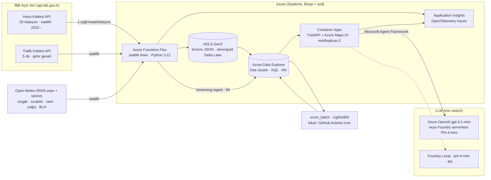

# İstanbul Nefes — Hava Kalitesi Erken Uyarı Veri Platformu

**Istanbul Air-Quality Early-Warning Data Platform on Azure** · Microsoft AI Innovators · 7 günlük solo sprint · Plan v2, 8 Eylül 2026 (3 bağımsız adversarial review sonrası)

> **Teslim tarihi / kanal:** `______` ← **Barbaros'un brifini bugün yazılı al** (video süresi, dil, repo public mı, yükleme adresi). Araştırma kamuya açık bir rubrik bulamadı; brif tek otorite.

> **BLUF:** İBB'nin canlı + geçmişe dönük hava kalitesi API'si (28 istasyon, saatlik, 2023'ten bugüne, kayıt yok) üzerine Azure'da uçtan uca çalışan bir **erken uyarı veri platformu**: Azure Functions saatlik toplar → ADLS Gen2 **Delta Lake** medallion → **Azure Data Explorer** (KQL) servis eder → LightGBM saatlik PM10 konsantrasyonunu 1/3/6 saat önceden tahmin eder, **ulusal 24 saat > 50 µg/m³ aşımını** lead-time ve yanlış alarm oranıyla ölçer → **Microsoft Agent Framework** "Nefes Analisti" TR/EN kaynak atıflı uyarı taslağı yazar → üç katmanlı eval README'de tablo olarak durur. Bicep + azd + GitHub Actions. Haftalık maliyet ≈ 4–12 $. **Fabric'e ve Azure OpenAI kotasına bağımlı değil** (ikisi de opsiyonel yükseltme).

---

## 1. Karar ve gerekçe

### Sana gönderilen 5 adayın hükmü

| Aday | Hüküm | Neden |
|---|---|---|
| 1. EnerjiIQ (EPİAŞ+TCMB, agentic retrieval) | ❌ Ele | İBB verisi yok (yeni şart), EPİAŞ kaydı Gün-0 blocker, Azure OpenAI + AI Search Basic ikili bağımlılık; öğrenci aboneliğinde OpenAI kotası büyük ihtimalle 0 |
| 2. Fabric RTI telemetri | ⚠️ Stretch | Trial okul tenant'ına bağlı, kişisel hesapla açılmıyor, trial'da Copilot/Data Agent yok; kritik yola konmaz |
| 3. Doc Intelligence pipeline | ❌ Ele | İBB verisi yok, F0 2 sayfa limiti |
| 4. Agentic lakehouse (Fabric Data Agent) | ❌ Ele | Ücretli F2+ ister, İngilizce-only, 25 satır cap; click-ops |
| 5. Azure SQL + pgvector hibrit BI | ⚠️ Parça | Azure SQL free offer bu planda **yedek servis katmanı** |

### Aynı İBB kaynaklarıyla alternatifler (review'da puanlandı, 1–5)

| Kriter | **Nefes** (AQ erken uyarı) | İETT "Nabız" (canlı otobüs bunching) | İSPARK doluluk tahmini |
|---|---|---|---|
| 7 gün fizibilite | 4 | 2 (geçmiş konum yok, SOAP, 100 istek/saat) | 3 (geçmiş yok → 5 günlük eğitim verisi) |
| MS anahtar kelime | 4 | 5 | 4 |
| Farklılaşma | 3 | 5 | 2 |
| Hiring sinyali | 4 | 4 | 3 |
| 1–2 yıl dayanıklılık | 5 | 2 (toplayıcı dursa tarih kaybolur) | 3 |
| **Toplam** | **20** | 18 | 15 |

Nefes, "Gün 3'te eğitilmiş model + dürüst sayı" üreten tek aday. İETT Nabız = ikinci proje / "sonraki adımlar" slaydı.

### Neden Nefes
1. **Veri var, canlı ve derin.** `GetAQIStations` 28 istasyon; `GetAQIByStationId` saatlik satırları hesaplanmış AQI, baskın kirletici, sağlık metniyle **2023 başından bugüne** veriyor (son satır dün 23:00). Kayıt/anahtar yok. Prior art: GitHub'da İstanbul + Azure + ajan kombinasyonu **boş** (yalnızca akademik CatBoost/RF makaleleri ve bir Android uygulaması).
2. **Data + AI + Cloud üçü de gerçek mühendislik** — DWH/ETL (EPAM), tahmin + ajan + eval (DOU-Synapse/CloudSentinel), IaC + CI + izleme (CloudSentinel). Yeni öğrenilecek tek büyük şey KQL; Fabric Eventhouse ile aynı motor.
3. **CBO ölçülebilir ve dürüst** (§2).
4. **Kohortun görünür tabanının üstünde** (notebook + Flask + "%85 doğruluk"): canlı URL, IaC, CI, eval tablosu, trace ekranı, maliyet.
5. **1–2 yıl yaşar** — yaşama garantisi **ADLS'teki bronze/Delta**'dır (ADX free cluster "haber vermeden kapatılabilir" diyor; README'de yaz).
6. **Önceki projelerle çakışmaz**: FraudOps = tabular fraud ML, CloudSentinel = bulut anomali + HITL ajan, DOU-Synapse = RAG. Nefes = zaman serisi + veri platformu + grounded ajan → "operasyon-sınıfı veri sistemleri kuran mühendis" çizgisi.

### Farklılaştırıcılar (README'de açıkça)
- Notebook değil, **canlı toplayan üretim hattı**; MAE değil **aşım olayı lead-time + yanlış alarm/ay**.
- Hedef **saatlik PM10 konsantrasyonu**; AQI indeksini **kendin yeniden hesaplıyorsun** ve İBB'nin değeriyle karşılaştırıyorsun (veri kalitesi kontrolü olarak).
- **Aynı ajan kodu** Foundry Local'da (M1, Metal) ve Azure'da: kamu verisi için edge/cloud çıkarım kararı.
- **Sayısal sadakat kontrolü**: cevaptaki her sayı araç çıktısında var mı (TR ondalık/binlik normalize edilerek).
- **Delta Lake lakehouse + KQL servis**: Fabric OneLake shortcut'ı Delta'yı doğrudan okur → "Fabric-ready" cümlesi dürüst.
- **Şeffaf sınırlar**: sitede 38 istasyon/PM2.5 var, API'de 28 istasyon/PM2.5 yok — README "Limitations" bölümünde sen söyle, jüri bulmasın.

---

## 2. Customer Business Outcome (videonun ilk 30 saniyesi)

- **Müşteri:** İBB Çevre Koruma ve Kontrol Dairesi Başkanlığı — **Hava Kalitesi İzleme Merkezi** (7/24 birim). Tek müşteri; İl Sağlık Müdürlüğü Bakanlık'a bağlı, karıştırma.
- **Persona:** vardiya operatörü. **Karar:** sabah 06:00'da ilçe belediyeleri/okullara uyarı notu.
- **Bugünkü durum:** havakalitesi.ibb.gov.tr ve CepHava yalnızca anlık gösteriyor, tahmin yok (videoda ekranla kanıtla).

**TR:** "İstanbul'da 28 istasyon saatlik ölçüm yapıyor ama uyarı, aşım *olduktan sonra* geliyor. Nefes, İBB açık verisini Azure'da işleyerek 24 saatlik PM10 sınır aşımlarını ortalama **[N] saat önceden**, **%[P] kesinlik** ve **ayda [F] yanlış alarmla** tahmin ediyor. 2025'te **[X] ilçede [Y] aşım saati** yaşandı; etkilenen hassas grup (65+ ve 0–14) **[Z] kişi**. Operatör sabah 06:00'da kaynak atıflı, iki dilli uyarı taslağını hazır buluyor."

**EN:** "Nefes turns İBB open data into an Azure early-warning platform: Azure Functions → Delta Lake → Azure Data Explorer → LightGBM forecasts → a Microsoft Agent Framework analyst, with measured groundedness."

**İkincil (%100 dürüst) çıktı:** veri kalitesi sözleşmesi — istasyon kesintisi/gecikme tespiti; model vasat çıksa bile bu ayakta kalır.

`[N] [P] [F] [X] [Y] [Z]` Gün 3 eval'inden gelir. **Uydurma sayı yok; olay sayısı azsa bunu da yaz.**

---

## 3. Mimari



### Servis seçimleri

| Katman | Servis | Neden | Yedek |
|---|---|---|---|
| Toplama | **Azure Functions Flex** (Python 3.12, `--instance-memory 512`, saatlik timer, UTC cron) | Serverless, IaC, öğrenci kotasına uyar; saatlik tek koşu ≈ 170 çalıştırma/hafta → sent | Linux Consumption Y1 (Flex bölgede yoksa/429) · Container Apps Job |
| Lake | **ADLS Gen2**; bronze = ham JSON.gz; silver/gold = **Delta Lake** (`deltalake` paketi, delta-rs) | Sent maliyet; "lakehouse/Delta" anahtar kelimesi (Databricks-komşu); Fabric OneLake shortcut Delta okur | Parquet |
| Servis/analitik | **Azure Data Explorer free cluster** (KQL, materialized view `arg_max`) | Abonelik/kart yok, ~100 GB, zaman serisi fonksiyonları, dashboard; Eventhouse ile aynı motor; bölge politikası ve spending limit'ten bağımsız | **Azure SQL free offer** (MI ile çalışır; headless ADX kapısı geçmezse) |
| Model | **LightGBM** batch, **Function dışında** (lokal veya GitHub Actions cron) | Functions imajında `libgomp.so.1` yok (LightGBM #7141 açık), 30 sn host-init | — |
| Ajan | **Microsoft Agent Framework 1.x** (Python) | GA Nis 2026; OpenAI-uyumlu client; OpenTelemetry | Düz OpenAI SDK + kendi tool loop |
| LLM | §6 karar ağacı | | |
| UI/API | **Container Apps** (`minReplicas: 0`, azd remote build) + **Azure Maps Web SDK** (Gen2/G2) | Free grant; 5.000 tile işlemi × 15 tile = 75k tile/ay | Static Web Apps; MapLibre + OSM |
| Eval | **azure-ai-evaluation 1.18** (`OpenAIModelConfiguration(base_url=…)` Foundry Local'ı judge olarak kabul ediyor) + kendi sadakat kontrolün | Anahtar kelime + gerçek ölçüm | — |
| Gözlem | **Application Insights** (azure-monitor-opentelemetry) | 5 GB/ay ücretsiz; **trace ekran görüntüsü** README'nin AI kanıtı | — |
| IaC/CI | **Bicep + azd** (başlangıç: `Azure-Samples/functions-quickstart-python-http-azd`), **GitHub Actions** = pytest + `az bicep build` | Bicep'i sıfırdan yazma; OIDC deploy stretch | Deploy lokal `azd deploy` |

---

## 4. Veri

### 4.1 Doğrulanmış kaynaklar (7–8 Eyl 2026 probe'ları)

| Kaynak | Endpoint | Şema | Tazelik | Gotcha |
|---|---|---|---|---|
| İstasyonlar | `GET https://api.ibb.gov.tr/havakalitesi/OpenDataPortalHandler/GetAQIStations` | `[{Id: GUID, Name, Adress, Location: "POINT (lon lat)"}]` · **28** (site: 28 sabit + 1 mobil; bir ölçümde 30 döndü — Gün 0'da say) | statik | WKT sırası **lon lat** |
| Saatlik ölçüm | `GET .../GetAQIByStationId?StationId=<guid>&StartDate=dd.MM.yyyy%20HH:mm:ss&EndDate=...` | `[{ReadTime, Concentration:{PM10,SO2,O3,NO2,CO}, AQI:{…,AQIIndex,ContaminantParameter,State,Color}}]` | saatlik, canlı | **30 günlük pencere 744 satır tam döndü** (cap yok gibi; 90/180/365 gün Gün 0'da dene). `f=csv` CSV vermiyor, mojibake → kullanma. `ReadTime` naif yerel saat (TR sabit UTC+3). EndDate dahil → (station, ts) dedupe. PM2.5 yok. |
| Trafik indeksi | `GET https://api.ibb.gov.tr/tkmservices/api/TrafficData/v1/TrafficIndexHistory/{gün}/{5M|H|D|M|Y}` | `[{TrafficIndex 1–99, TrafficIndexDate}]` | 5 dk | `/30/H` 30 gün saatlik |
| Hava durumu | Open-Meteo ERA5 archive (geçmiş) + forecast API (canlı) — ücretsiz, anahtarsız | wind speed/dir, temp, RH, precip, boundary-layer height | saatlik | Microsoft değil; Azure Maps Weather = 1.000 ücretsiz/ay sonra 4,50 $/1K → yalnızca "current conditions" demosu |
| Tatiller | `holidays` PyPI (`holidays.TR`) | Ramazan/Kurban + arife yarım gün | — | Elle CSV yazma |
| İlçe nüfusu | TÜİK ADNKS 2025 (bülten 53899, 9 Şub 2026): İstanbul 15.754.053, 39 ilçe | `district, pop_total, pop_0_14, pop_65p` | yıllık | Elle CSV, kaynak README'de |
| (Ek, stretch) Trafik yoğunluğu | CKAN `hourly-traffic-density-data-set` | geohash-6 saatlik, ~1,76M satır/ay, Ocak 2025'te durmuş | — | 100–143 MB/ay, Range yok; disk 31 GiB boş — Belbim 68 GB setine dokunma |

**AQI indeksi gerçeği (review bulgusu):** İBB, PM10 indeksini **24 saatlik ortalama** + US-EPA breakpoint'leriyle hesaplıyor (O3/CO 8 saat; yalnızca SO2/NO2 saatlik). Ocak 2023 Maslak: konsantrasyon 214 µg/m³ iken indeks 78, saatler içinde 102'ye tırmanıyor. Sonuç: `AQIIndex > 100` ≈ 24 saat PM10 ≥ ~155 → **nadir** (son 30 gün Maslak: max 78, sıfır olay). Bu yüzden hedef ve olay tanımı §5.1'deki gibi.

**Veri kalitesi ölçümleri:** PM10 null Maslak son 30 gün **%18,7**, Ocak 2023 %7,5; NO2 bazı aylarda tamamen null, CO görülen tüm satırlarda null → **istasyon × ay null oranını ölçmeden özellik seçme**.

**Gateway:** araştırmada ~15 hızlı çağrıda 503; 7 sn aralıkla 4 çağrı sorunsuz. Kural: **≥ 6 sn aralık, exponential backoff, cache, idempotent yazma**; Gün 0'da 20 çağrı @ 6 sn ile throttle'ı ölç.

**Lisans:** İBB Açık Veri Lisansı (CC BY 4.0 tabanlı). README + UI altbilgisi: *"Kamu sektörü bilgilerini içerir — İBB Açık Veri Portalı, İBB Açık Veri Lisansı (CC BY 4.0)."*

### 4.2 Backfill (Gün 0 gecesi başlar)
- Pencere **30 gün** (doğrulandı); Gün 0'da 90/180/365 dene. Aralık **1 Eyl 2024 → bugün** (2 yıl): 28 × 24 ≈ **672 çağrı ≈ 1,1 saat** @ 6 sn. 2023–24 kışı **arka planda** (üçüncü kış = daha çok olay).
- Lokal script `src/backfill/backfill_aq.py`, `checkpoint.json`, lokal diske JSON.gz → sonra ADLS'e yükle. Timer Function'ı **backfill bittikten sonra** aç (gateway'e aynı anda iki kaynak vurmasın).
- Weather backfill: Open-Meteo ERA5, 28 koordinat × 2 yıl saatlik, hızlı.

### 4.3 Medallion şeması
```
bronze/  aq/station=<id>/year=/month=/*.json.gz (ham + alınma zamanı)   traffic_index/   weather/
silver/  aq_hourly (Delta)     : station_id, ts_local, ts_utc, pm10, so2, o3, no2, co, aqi_ibb, aqi_recomputed, aqi_dominant, quality_flags
         weather_hourly (Delta): station_id, ts_utc, wind_speed, wind_dir, temp, rh, precip, blh
         traffic_index_hourly (Delta)
gold/    features_hourly · forecasts · exceedance_events · dq_daily  (Delta)
```
ADX: `AqHourly`, `WeatherHourly`, `TrafficIndex`, `Forecasts`, `ExceedanceEvents`, `DqDaily`; materialized view `AqLatest = AqHourly | summarize arg_max(ts_utc, *) by station_id` (update policy gerekmez).

### 4.4 Veri kalitesi sözleşmesi (`DqDaily`)
Tazelik (max lag saat/istasyon), null oranı (kirletici × istasyon), duplicate (station, ts), aralık (PM10 0–1000), gün başına satır, **`aqi_ibb` vs `aqi_recomputed` fark sayısı**. Günlük KQL + README rozeti.

---

## 5. AI katmanı

### 5.1 Tahmin modeli
- **Hedef:** istasyon bazında **saatlik PM10 konsantrasyonu** t+1, t+3, t+6. (Indeks 24 saat ortalaması olduğu için persistence'ı yapay olarak iyi gösterir — indeksi tahmin etme.)
- **Olay tanımları:** birincil = **24 saatlik ortalama PM10 > 50 µg/m³** (ulusal sınır; kışın sık); ikincil = `AQIIndex > 100` (hassas gruplar). Her ikisi de tahmin edilen saatlik değerlerden türetilir.
- **Özellikler:** lag 1/2/3/6/12/24/48, rolling mean/max 3/6/24, saat, gün, hafta sonu, tatil/arife, mevsim, istasyon (kategorik), **hava durumu** (rüzgâr hızı/yönü, sıcaklık, nem, yağış, BLH — geçmiş ERA5, canlı forecast), **stretch:** trafik indeksi, İETT otobüs hız proxy'si.
- **Bölme:** **rolling-origin, 4 fold, mevsimleri kapsayan** (ör. fold sonları 2025-03, 2025-09, 2026-03, 2026-08); **fold başına olay sayısı raporlanır**; manşet = havuzlanmış + mevsim tablosu. Gün 1'de ilk istasyonlar inince **aylık olay taban oranını hesapla, split'i ona göre kilitle** (DECISIONS #2).
- **Baseline'lar:** persistence, seasonal-naive (24 saat), istasyon-saat ortalaması. Model geçemiyorsa yaz.
- **Metrikler:** MAE/RMSE (ufuk × istasyon); olaylar için precision/recall/F1, **ortalama lead time (saat)**, **yanlış alarm/ay**, PR-AUC. Model kartı.
- **Servis:** `score_batch.py` saatlik, **lokal veya GitHub Actions cron** (headless ADX principal ile) → `Forecasts`.

### 5.2 "Nefes Analisti" (Microsoft Agent Framework)
- **5 araç**, hepsi parametrik KQL (free-form yok): `get_station_status`, `get_forecast(station, horizon)`, `list_exceedances(since, district?)`, `draft_advisory(district, level, lang)`, `get_data_freshness`.
- Tek sistem promptu + dil kuralı (TR soru → TR, EN → EN). Kurallar: yalnız araç çıktısı; her sayıya istasyon + zaman damgası; veri yoksa "veri yok".
- Client `LLM_BASE_URL`/`LLM_MODEL` env ile Azure ↔ Foundry Local. Foundry Local tool-calling küçük modelde best-effort → yedek: JSON çıktı + dispatcher (MAF middleware); `foundry model list` → `tools` etiketli model (phi-4-mini / qwen2.5-7b).
- Tracing: OpenTelemetry → App Insights; **agent span → tool span → model span ekran görüntüsü** README'ye (bu, "ajan" kanıtıdır).
- **UI'da `?as_of=<ts>` replay:** Eylül'de harita yeşil; videoda gerçek bir geçmiş kış episodunu oynat.

### 5.3 Üç katmanlı eval
1. **Tahmin:** §5.1 → `eval/results/forecast_summary.md`.
2. **Ajan:** `eval/gold_set.jsonl` **20 soru** (10 TR / 10 EN; bakış, tahmin, uyarı taslağı), beklenen araç + sayılar. Manşet satırlar: **tool-call doğruluğu, sayısal sadakat** (TR `12,5` / `1.250` normalize); ikincil: Groundedness/Relevance 1–5 (`azure-ai-evaluation`; judge Azure OpenAI varsa, yoksa Foundry Local "küçük model judge, gösterge niteliğinde"); p50/p95 gecikme; sorgu başına token/maliyet.
3. **Veri kalitesi:** §4.4.
Videoda **bir başarısızlık + düzeltme anı**: ajan sayı uyduruyor → sadakat kontrolü reddediyor → atıflı yeniden üretim.

---

## 6. LLM karar ağacı (Gün 0)

```
1) ai.azure.com → Foundry projesi → gpt-4.1-mini Global Standard deploy dene
   ├─ TPM ≥ 10k → Azure OpenAI birincil (judge dahil); Foundry Local = "edge" demosu
   └─ kota 0 / 1k / bölge reddi → formu ANINDA doldur: https://aka.ms/oai/stuquotarequest
2) Aynı projede "sold by Azure" serverless model dene (Phi-4-mini / Mistral):
   Eylül 2026 Q&A'da bir öğrenci kredi karşılığı başarılı deploy bildirdi → cloud Microsoft çıkarımı için orta yol
3) İkisi de yoksa → Foundry Local birincil; Azure gelirse Gün 5'e kadar env switch
4) En son çare → kişisel hesapta Azure free trial ($200/30 gün, kart) yalnızca LLM için, ayrı RG + budget
```
Bilinenler: Azure OpenAI genel kayıt formu kalktı; Microsoft personeli (Tem 2026) öğrencide OpenAI deploy'un desteklenmediğini yazdı; resmi kota tablosu "Students: N/A". **GitHub Models 30 Tem 2026'da tamamen emekli.** Foundry Local GA, Apple Silicon Metal. Risk seviyesi: **Orta** (serverless orta yol sayesinde).

---

## 7. Gün 0 — bugün, hemen başla (≈5 saat)

Makine: M1/16 GB, **31 GiB boş disk**; `gh`, `node`, `brew`, **Python 3.12.13 zaten kurulu** (`/opt/homebrew/bin/python3.12`), sistem Python 3.14. `az`, `azd`, `func`, `docker`, `foundry` yok (Docker gerekmiyor; azd remote build).

```bash
# 0. Araçlar (~30 dk; Foundry model indirmesi arka planda)
brew install azure-cli azd uv
brew tap azure/functions && brew install azure-functions-core-tools@4
brew tap microsoft/foundrylocal && brew install foundrylocal      # komutu docs'tan doğrula
uv venv -p 3.12 .venv && source .venv/bin/activate
foundry model list | grep -i tools && foundry model run phi-4-mini &   # arka planda indir

# 1. Abonelik, tenant, bölge, sağlayıcılar
az login && az account show -o table                # hangi tenant? (ADX kapısı için kritik)
az policy assignment list -o table                  # "Allowed resource deployment regions"
az functionapp list-flexconsumption-locations -o table   # ∩ izinli bölgeler = Function bölgesi
for p in Microsoft.App Microsoft.Web Microsoft.Storage Microsoft.Maps Microsoft.CognitiveServices Microsoft.Insights; do az provider register -n $p; done

# 2. ADX free cluster KAPISI — aboneliğin sahibi olan AYNI kimlikle oluştur
#    https://dataexplorer.azure.com/freecluster → DB 'nefes'
#    .create table T (ts:datetime, v:real)   |   .alter table T policy streamingingestion enable
#    Mac'ten: azure-kusto-data with_az_cli_authentication → 1 sorgu + 1 streaming ingest
#    Function deploy edince: .add database nefes ingestors ('aadapp=<function MI clientId>;<tenantId>') → Function'dan 1 ingest
#    Geçmezse: app registration + secret; o da yoksa → Azure SQL free offer (DECISIONS #1)

# 3. LLM kapısı → §6 (portal). Formu doldur. Serverless "sold by Azure" modeli de dene.

# 4. İBB probe (≥6 sn aralık)
#    GetAQIStations → say (28 mi 30 mu)
#    Maslak için 90 / 180 / 365 günlük pencere → satır sayısı (cap var mı)
#    20 çağrı @ 6 sn → 503 geliyor mu (throttle eşiği)

# 5. Azure Maps: az maps account create --sku G2 --kind Gen2 --location global → reddederse MapLibre + OSM
# 6. Budget: Cost Management $20 ve $40 uyarı; Sponsorships portalında bakiyeyi not et
# 7. Repo: gh repo create istanbul-nefes --private; iskelet §9; DECISIONS.md ilk 5 karar
# 8. backfill_aq.py v0 → BU GECE başlat (lokal disk, checkpoint) — Open-Meteo backfill de
```

**Gün 0 "bitti":** backfill çalışıyor; headless ADX ingest + query geçti (veya SQL'e karar verildi); Flex bölgesi biliniyor; LLM yolu seçildi; teslim tarihi PLAN'a yazıldı. **Bunlar geçmeden özellik kodu yok.** Fabric kontrolü Gün 0'da yok (gürültü).

---

## 8. Yedi günlük plan (revize; her günün "bitti" kriteri var)

| Gün | Odak | Bitti kriteri |
|---|---|---|
| **0** (Sal 8 Eyl, bugün) | §7 | yukarıda |
| **1** (Çar) | azd iskeleti (resmi Flex örneğinden) → `azd up` · `ibb_client` + **8 test** (kayıtlı fixture) · CI (pytest + `az bicep build`, 20 satır) · bronze→silver **Delta** · ADX şema + bulk ingest (backfill) · saatlik timer Function (28 istasyon + trafik + hava) — backfill bitince aç · **aylık olay taban oranı → split kararı (DECISIONS #2)** · `DqDaily` KQL | ADX'te ≥ 2 yıl × 28 istasyon; Function canlı yazıyor; CI yeşil; taban oranı + split yazıldı |
| **2** (Per) | `features_hourly` + `holidays.TR` + hava durumu join + **8 test** · baseline'lar + rolling-origin metrik harness'ı · istasyon→ilçe CSV (30 satır, elle) + TÜİK nüfus · **PM 3 saat timebox:** 1 kış ayı trafik yoğunluğu → geohash join → korelasyon grafiği (kayarsa Gün 7) | features Delta; baseline tablosu `forecast_summary.md`'de; (ops.) grafik |
| **3** (Cum) | LightGBM 3 ufuk · olay P/R/F1 + lead time + yanlış alarm/ay · model kartı · `score_batch.py` (lokal/GH cron) → `Forecasts` | `forecast_summary.md`; `[N] [P] [F] [X] [Y] [Z]` dolduruldu |
| **4** (Cmt) | `tools.py` (5 parametrik KQL) + test · FastAPI · Azure Maps sayfası (renkler, tahmin paneli, **`as_of` replay**) · Container Apps Bicep (`minReplicas: 0`) + `azd deploy` | **Canlı URL**: harita + tahmin; replay geçmiş bir aşımı gösteriyor |
| **5** (Paz) | MAF ajanı `tools.py` üstünde, TR/EN · sadakat kontrolü (TR sayı normalizasyonu) + **10 test** · 20 soruluk gold set · eval koşusu (judge: AOAI geldiyse o, yoksa Foundry Local + not) · tracing → App Insights · UI'a sohbet paneli · redeploy · **Pazar akşamı feature freeze** | `agent_summary.md`; trace ekran görüntüsü; sohbet canlı |
| **6** (Pzt) | README (EN önce/yan yana; rozetler; **PNG** mimari; Sonuçlar > Kurulum; Limitations: 28/38 istasyon, PM2.5 yok; "çalışır tutmanın maliyeti") · ARCHITECTURE · DECISIONS · NOTICE · ekran görüntüleri · video senaryosu + kayıt 2,5 dk · ücretli parçalar `azd down` (Function/Storage/ADX kalır) | Video `<hedef>`e yüklendi; README tam; bakiye kontrolü |
| **7** (Sal 15 Eyl) | **Önce teslim.** Sonra stretch sırayla: OIDC deploy workflow · 4 aylık trafik join · Event Hubs → ADX · Fabric Eventhouse mirror · İETT hız proxy'si | Teslim, son tarihten önce |

**Kural:** Pazar akşamından sonra yeni özellik yok. Kayma stretch'ten kesilir, çekirdekten değil. Test hedefi ≥ 25, günlere dağıtılmış (8/8/10 + tools).

---

## 9. Repo yapısı
```
istanbul-nefes/
├── README.md · PLAN.md · DECISIONS.md · ARCHITECTURE.md · LICENSE (MIT) · NOTICE (İBB atıf)
├── azure.yaml · infra/main.bicep · infra/modules/{storage,functions,containerapps,insights,maps}.bicep
├── src/
│   ├── collector/     function_app.py (hourly timer) · ibb_client.py · weather_client.py · kusto_writer.py · lake_writer.py
│   ├── backfill/      backfill_aq.py (checkpoint) · backfill_weather.py · (stretch) load_traffic_density.py
│   ├── features/      build_features.py · aqi_recompute.py · calendar_tr.py
│   ├── model/         train.py · evaluate.py (rolling-origin) · score_batch.py · model_card.md
│   ├── agent/         agent.py · tools.py · system_prompt.md · faithfulness.py
│   └── api/           main.py (FastAPI, ?as_of=) · static/index.html (Azure Maps)
├── kql/               schema.kql · queries.kql · dashboard.json
├── eval/              gold_set.jsonl · run_eval.py · results/
├── tests/             test_ibb_client.py · test_features.py · test_aqi_recompute.py · test_faithfulness.py · test_tools.py
├── data/reference/    stations.json · station_district.csv · districts_population.csv
├── docs/              video_script.md · cost.md · screenshots/{trace,map,eval}.png
└── .github/workflows/ ci.yml · (stretch) deploy.yml · score-cron.yml
```

**DECISIONS.md tohumları:** #1 ADX free vs Eventhouse vs Azure SQL (trial okul tenant'ında kapalı; aynı Kusto motoru; DB shortcut ile göç yolu; free cluster sınırları/yıllık yenileme) · #2 hedef = saatlik konsantrasyon, indeks değil; olay tanımı ve split · #3 LLM yolu · #4 skorlama Function dışında (libgomp) · #5 Delta > Parquet · #6 trafik join stretch'e · #7 saatlik toplama, 5 dk rotasyon değil (maliyet + gateway).

---

## 10. Maliyet (haftalık, USD)

| Kalem | Tahmin | Not |
|---|---|---|
| ADLS Gen2 (birkaç GB) + ayrı Functions host storage | < 0,20 | |
| Azure Functions Flex, **saatlik**, 512 MB (~170 koşu/hafta) | ≈ 0,05 | 5 dk rotasyon + 2 GB olsaydı ≈ 2,3 $ (grant öğrencide belirsiz) |
| Azure Data Explorer free cluster | 0 | aboneliksiz |
| Container Apps `minReplicas: 0` | 0 | `minReplicas: 1` olursa ≈ 1,5–2 $ |
| **ACR Basic** (azd remote build) | ≈ 1,2 | 0,1666 $/gün; kaçınmak için Static Web Apps + Functions HTTP |
| Azure Maps Gen2 | 0 | tile bol; Weather'ı stretch'te tut |
| Application Insights | 0 | 5 GB/ay |
| Azure OpenAI / Foundry serverless (eval + demo ≈ 2M token) | 2–5 | varsa |
| Event Hubs Basic (stretch) | 2,5 | |
| **Toplam** | **≈ 4–12** | Budget $20/$40; AI Search Basic ve Stream Analytics **yok** |

---

## 11. Video senaryosu (2:30, TR ana + EN altyazı; **isimleri sesli söyle**, transkript-tabanlı grader için)

| Zaman | İçerik | Söylenen anahtar kelimeler |
|---|---|---|
| 0:00–0:30 | Başlık kartı + canlı URL; persona (İzleme Merkezi vardiya operatörü); §2 cümlesi ile **3 sayı** (lead time, kesinlik/yanlış alarm, etkilenen nüfus); ekranda mimari PNG; altbilgide İBB atıfı | Customer Business Outcome, İBB Açık Veri, Microsoft Azure, Data + AI + Cloud |
| 0:30–1:15 | Canlı demo: Azure Maps harita → `as_of` replay ile geçmiş kış episodu → istasyon turuncuya döner → tahmin paneli "3 saat sonra sınır aşımı" → ajan TR uyarı taslağı + EN → **başarısızlık + düzeltme anı** (uydurulan sayı reddedilir) | Azure Data Explorer, KQL, Azure Functions, Container Apps, Microsoft Agent Framework, Microsoft Foundry / Foundry Local |
| 1:15–1:50 | Mimari yürüyüşü: Functions → Delta Lake → ADX → model → ajan; Bicep + Azure Developer CLI; "aynı ajan Mac'te Foundry Local'da"; App Insights trace ekranı | Bicep, azd, Delta Lake, lakehouse, OpenTelemetry, Application Insights |
| 1:50–2:20 | Kanıt: tahmin tablosu (baseline vs model, lead time, yanlış alarm), ajan eval (sadakat, tool-call doğruluğu, groundedness), CI yeşil, maliyet, Limitations | Azure AI Evaluation, groundedness, GitHub Actions, cost |
| 2:20–2:30 | Sonraki adımlar: Fabric Eventhouse mirror (OneLake shortcut Delta'yı okur), İETT/İSPARK akışları, Event Hubs | Microsoft Fabric, Real-Time Intelligence, Event Hubs |

---

## 12. Riskler ve Plan B

| Risk | Olasılık | Etki | Plan B |
|---|---|---|---|
| Function → ADX free cluster headless auth geçmez | **Orta (Gün 0'a kadar bilinmiyor)** | Yüksek | App registration + secret; o da yoksa Azure SQL free offer (MI ile); ADX yalnızca analist/dashboard |
| Azure OpenAI kotası yok | Orta | Orta | Foundry serverless "sold by Azure" → Foundry Local (§6) |
| Flex bölgede yok / 429 | Orta | Düşük | Başka izinli bölge; Linux Consumption Y1 |
| Bölge politikası Container Apps/Maps engeller | Orta | Orta | `az policy` ile izinli bölge; MapLibre + OSM; Static Web Apps |
| Yaz test penceresinde sıfır olay | **Tasarımla çözüldü** | — | Rolling-origin mevsimsel fold'lar + 24 s > 50 eşiği + olay sayısı raporu |
| Model baseline'ı geçemez | Orta | Orta | Dürüstçe yaz; hava durumu özellikleri en büyük kaldıraç; DQ çıktısı ayakta kalır |
| İBB gateway 503 / API değişir | Orta | Yüksek | Backoff + cache; bronze ham JSON → yeniden işlenebilir; son 30 günün snapshot'ı repo'da |
| Foundry Local tool-calling güvenilmez | Orta | Orta | JSON çıktı + dispatcher; qwen2.5-7b |
| App registration / OIDC okul tenant'ında kapalı | Orta | Düşük | CI sadece test; deploy lokal |
| ADX free cluster kapanır | Düşük | Düşük | Delta Lake tek gerçek kaynak; SQL/Eventhouse'a yeniden ingest |
| Spending limit aboneliği kapatır | Düşük | Yüksek | Pahalı servis yok; budget alert; ADX + Foundry Local abonelikten bağımsız çalışır |

**Stretch (Gün 7 sonrası, sırayla):** OIDC deploy · 4 aylık trafik geohash join · Event Hubs → ADX connector · Fabric Eventhouse mirror + Real-Time Dashboard · İETT canlı otobüs hızı (istasyon 2,5 km) proxy'si · İSPARK akışı · Azure Maps Weather.

---

## 13. README kanıt listesi (hiring sinyali)
- [ ] EN önce / yan yana; rozetler (CI, test sayısı, lisans); **PNG** mimari diyagram ilk ekranda
- [ ] **Sonuçlar** Kurulum'dan önce: baseline vs model, olay P/R/lead time/yanlış alarm, fold başına olay sayısı
- [ ] Ajan eval tablosu: sadakat, tool-call doğruluğu, groundedness (judge notu), p95, sorgu maliyeti
- [ ] App Insights **trace** ekran görüntüsü (agent → tool → model span)
- [ ] Veri kalitesi rozeti + `aqi_ibb` vs `aqi_recomputed`
- [ ] `azd up` tek komut; `tests/` ≥ 25
- [ ] **Limitations**: 28/38 istasyon, PM2.5 yok, NO2/CO null, free cluster garantisi yok
- [ ] Maliyet tablosu + "çalışır tutmanın aylık maliyeti"; DECISIONS.md
- [ ] İBB atıf satırı; 2,5 dk video linki

## 14. Yapılmayacaklar
Fabric'e bağlı kritik yol · Azure ML managed endpoint · LSTM/derin öğrenme · AQI **indeksini** tahmin etmek · free-form NL2SQL/NL2KQL · skorlamayı Function içinde çalıştırmak · 5 dk'lık toplama rotasyonu · Copilot Studio · çoklu ajan · Power BI Desktop · Assistants API / prompt flow / Synapse / Azure Data Studio / `azure-ai-inference` (emekli) · AI Search Basic · Stream Analytics · Marketplace · Belbim 68 GB seti · `f=csv`.

## 15. Doğrulanmış kaynaklar
- İBB CKAN: https://data.ibb.gov.tr/api/3/action/status_show · Lisans: https://data.ibb.gov.tr/license · AQI mevzuatı (24 s ortalama): https://havakalitesi.ibb.gov.tr/Icerik/mevzuat/hava-kalitesi-indeksi
- Hava kalitesi servisi: https://data.ibb.gov.tr/api/3/action/package_show?id=hava-kalitesi-istasyon-olcum-sonuclari-web-servisi · Trafik indeksi: https://data.ibb.gov.tr/dataset/trafik-indeks-degeri-web-servisi · Trafik yoğunluğu: https://data.ibb.gov.tr/api/3/action/package_show?id=hourly-traffic-density-data-set
- TÜİK ADNKS 2025: https://veriportali.tuik.gov.tr/tr/press/53899
- Azure for Students: https://azure.microsoft.com/en-us/free/students/ · Spending limit: https://learn.microsoft.com/en-us/azure/cost-management-billing/manage/spending-limit · Bölge politikası: https://learn.microsoft.com/en-us/answers/questions/5592949/cannot-find-allowed-resource-deployment-regions-un
- Azure OpenAI öğrenci (Tem 2026): https://learn.microsoft.com/en-us/answers/questions/5949792/azure-for-students-unable-to-deploy-any-azure-open · Foundry serverless öğrenci (Eyl 2026): https://learn.microsoft.com/en-us/answers/questions/5994365/foundry-serverless-deployment-using-azure-students · Kota: https://learn.microsoft.com/en-us/azure/foundry/openai/quotas-limits
- ADX free cluster: https://learn.microsoft.com/en-us/azure/data-explorer/start-for-free · Kusto principals (aadapp/MI): https://learn.microsoft.com/en-us/kusto/management/reference-security-principals · ADX→Fabric göç rehberi: https://learn.microsoft.com/en-us/fabric/real-time-intelligence/migrate-azure-data-explorer
- Azure SQL free offer: https://learn.microsoft.com/en-us/azure/azure-sql/database/free-offer
- Functions Flex: https://learn.microsoft.com/en-us/azure/azure-functions/flex-consumption-plan · how-to (bölge listesi): https://learn.microsoft.com/en-us/azure/azure-functions/flex-consumption-how-to · Storage: https://learn.microsoft.com/en-us/azure/azure-functions/storage-considerations · LightGBM libgomp: https://github.com/microsoft/lightgbm/issues/7141
- Container Apps billing: https://learn.microsoft.com/en-us/azure/container-apps/billing · Fiyat: https://azure.microsoft.com/en-us/pricing/details/container-apps/
- Azure Maps Gen2: https://learn.microsoft.com/en-us/azure/azure-maps/how-to-manage-pricing-tier · İşlem sayımı: https://learn.microsoft.com/en-us/azure/azure-maps/understanding-azure-maps-transactions
- Microsoft Agent Framework 1.0: https://devblogs.microsoft.com/agent-framework/microsoft-agent-framework-version-1-0/ · Foundry Local tool calling: https://learn.microsoft.com/en-us/azure/foundry-local/how-to/how-to-use-tool-calling-with-foundry-local
- azure-ai-evaluation: https://pypi.org/project/azure-ai-evaluation/ · OpenAIModelConfiguration: https://learn.microsoft.com/en-us/python/api/azure-ai-evaluation/azure.ai.evaluation.openaimodelconfiguration?view=azure-python
- Fabric trial: https://learn.microsoft.com/en-us/fabric/fundamentals/fabric-trial · Lisans: https://learn.microsoft.com/en-us/fabric/enterprise/licenses
- GitHub Models emekliliği: https://docs.github.com/en/github-models/use-github-models/prototyping-with-ai-models
- Prior art (İstanbul, akademik): https://link.springer.com/article/10.1007/s00704-025-05658-x · https://dergipark.org.tr/tr/pub/gazibtd/article/1426942 · Azure AQ erken uyarı (Tayvan ACES): https://pmc.ncbi.nlm.nih.gov/articles/PMC6926579/
- Bicep başlangıcı: https://github.com/Azure-Samples/functions-quickstart-python-http-azd
